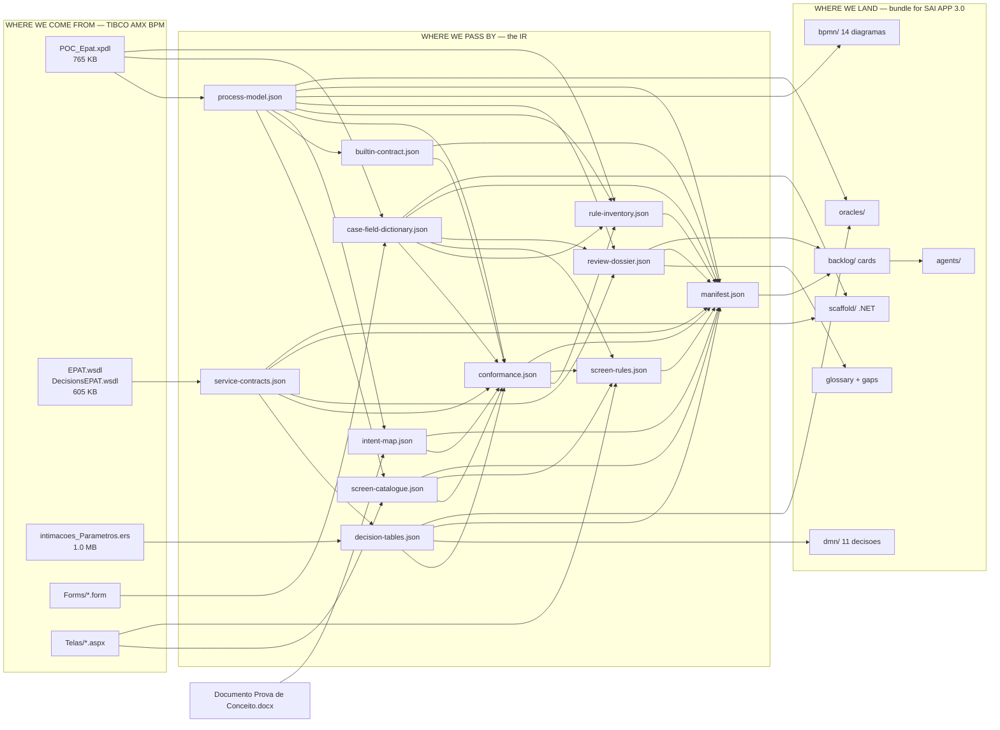

# Data Flow — TIBCO → IR → .NET Bundle

**Package:** POC_Epat (SEFAZ-SP ePAT)
**Question this document answers:** where the data comes from, what it passes through, and where it lands.

For the *schema* of each artifact see [artifacts/README.md](artifacts/README.md).
For the *architecture* and its rationale see [SOLUTION_ARCHITECTURE.md](SOLUTION_ARCHITECTURE.md).

---

## 1. The whole journey in one picture

---

## 2. Where we come from — the source artifacts

Declared in [config/packages/POC_Epat.json](config/packages/POC_Epat.json); every file is pinned by sha256 at stage S0.

| # | Source | Size | Holds | sha256 (prefix) |
|---|--------|------|-------|-----------------|
| 1 | `POC_Epat.xpdl` | 765 KB | 9 processes, 215 activities, 221 transitions, 5 activity sets, 209 case fields | `1ab99203fc33` |
| 2 | `EPAT.wsdl` | 549 KB | 127 operations, message schemas, technical envelope | `79e72f60f0b2` |
| 3 | `DecisionsEPAT.wsdl` | 56 KB | Decision service contract | `2e4ec2922813` |
| 4 | `intimacoes_Parametros.ers` | 1.0 MB | Corticon rulesheet: 49 rule columns × 21 conditions, 276 action cells | `ad862907cdd3` |
| 5 | `Forms/*.form` (7) | — | Field type declarations, labels, form/step bindings | — |
| 6 | `Telas/*.aspx(.cs)` (4) | — | 2 legacy ASP.NET screens the user tasks hand off to, 2 750 lines of code-behind | — |
| 7 | `Documento Prova de Conceito.docx` | — | The only statement of what each stage is FOR | `dc3fb59db03d` |

### Referenced but never delivered

The XPDL declares **15 external packages** whose files were not provided:

`NotificacaoAIIM`, `EPAT_SEGUNDA`, `EPAT_SEGUNDA1`, `GERAL`, `Decisions`, `Calendario`,
`EPAT IPROCESS`, `EPAT`, `Process`, `GED`, `GED2`, `iProcess`, `Intimacao`, and others.

This is the root cause of several open questions — notably why `MAXRETRIES` has no visible
initial value, and why the `graft-step` targets cannot be resolved statically.

---

## 3. Where we pass by — the intermediate representation

Nine extraction generators plus a review pass and a conformance pass. Each reads only artifacts,
never the raw source twice, so the IR is the single point where knowledge accumulates.

| Stage | Generator | Reads | Produces | Size |
|-------|-----------|-------|----------|------|
| S1.1 | `gen-process-model.ps1` | xpdl | `process-model.json` | 410 KB |
| S1.2 | `gen-field-dictionary.ps1` | process-model + forms | `case-field-dictionary.json` | 327 KB |
| S1.3 | `gen-service-catalogue.ps1` | wsdl + process-model | `service-contracts.json` | 894 KB |
| S1.4 | `gen-decision-table.ps1` | ers + service-contracts | `decision-tables.json` | 308 KB |
| S1.5 | `gen-screen-catalogue.ps1` | telas + process-model + fields | `screen-catalogue.json` | 11 KB |
| S1.5b | `gen-builtin-contract.ps1` | process-model | `builtin-contract.json` | 16 KB |
| S1.5c | `gen-intent-map.ps1` | docx + process-model | `intent-map.json` | 9 KB |
| S1.6 | `gen-review-dossier.ps1` | model + fields + services + catalog | `review-dossier.json` + glossary seed | ~180 KB |
| S1.7 | `gen-conformance.ps1` | every artifact + poc-concepts | `conformance.json` | 28 KB |
| S1.8 | `gen-rule-inventory.ps1` | xpdl + model + fields + conformance | `rule-inventory.json` | 87 KB |
| S1.9 | `gen-screen-rules.ps1` | telas + screen-catalogue + fields + conformance | `screen-rules.json` | 106 KB |
| S1.10 | `run-extraction.ps1` | everything | `manifest.json` (sha256 of all) | 2 KB |

### What each IR artifact carries

| Artifact | Content |
|----------|---------|
| `process-model.json` | 9 processes, 14 scopes, 215 nodes (15 kinds), 221 edges, resolved link/signal edges, **54 migration hazards** |
| `case-field-dictionary.json` | 209 fields with CLR types, 18 SW_NA sentinels, 4 arrays, 62 unreferenced, 23 label suggestions, 14 recovered full names, 19 technical/envelope fields |
| `service-contracts.json` | 127 operations (5 invoked), endpoints and transport (SOAP over JMS/EMS), technical envelope (HEADER/RESULT/ERROR), process bindings |
| `decision-tables.json` | 73 vocabulary terms, 49 rule columns, 276 action cells, condition/action rows, case-field mapping |
| `screen-catalogue.json` | 2 screens, both bound to user tasks, 1 undeclared field, 5 missing controls |
| `builtin-contract.json` | 13 iProcess builtins across 30 calls, 1 behavioural vector, 7 script risks |
| `intent-map.json` | 7 stages from the PoC document, 5 tied to model elements out of 182 |
| `conformance.json` | 19 PoC concepts: 19 extracted, 1 proven in execution, 4 blocked |
| `rule-inventory.json` | 104 rule carriers in the XPDL across 5 sources: 32 business rules + 7 fixed SLAs, 20 on the PoC path |
| `screen-rules.json` | 154 decisions in 2 750 lines of code-behind: 8 write back to the engine, 20 validations, 14 backend calls, 6 divergent cloned methods |
| `review-dossier.json` | 34 open questions ordered P1–P4, of which 7 are constructs with **no .NET equivalent** |
| `manifest.json` | sha256 of every source and artifact, counts, drift tripwire |

### The gate between transit and landing

Stage S2 runs **27 checks** (`validate-artifacts.ps1`) before anything is emitted:

- `PM-001..011` — graph integrity: unique ids, resolvable endpoints, boundary hosts, link resolution, default branches
- `CF-001..005` — state model: declared fields, CLR mapping, sentinel nullability
- `SC-001..004` — integration: every service task binds to a catalogued operation
- `DT-001..005` — rules: vocabulary terms, column ordering (override semantics preserved)
- `CV-001..004` — **coverage**: every XPDL Activity → node, Transition → edge, ActivitySet → scope, WorkflowProcess → process

`CV-*` is the IR-completeness oracle: it is what proves nothing was lost in transit.

---

## 4. Where we land

### 4.1 Already produced

| Output | From | What it is |
|--------|------|-----------|
| `bpmn/` — 14 diagrams | process-model | 215 nodes, 221 flows, self-verified references |
| `dmn/` — 11 decisions + mirror | decision-tables | FIRST hit policy + a RULE ORDER mirror preserving the 49-column override semantics |
| `glossary/POC_Epat.yaml` | review-dossier | 42 fields, 7 decisions, 6 unresolved, 7 gaps — the only place human answers live |

**Proof of landing, not just arrival:** `verify-dmn-equivalence.ps1` executes the emitted DMN and the
original Corticon rules over **3,000 randomized cases across 11 output attributes** and reports zero
divergence. The rules are not merely translated — they are demonstrably equivalent.

### 4.2 Still to be produced

| Output | Blocked on |
|--------|-----------|
| `scenarios/` — journey oracles | — (next generator) |
| `oracles/` — golden fixtures | scenarios |
| `backlog/` — build + validation cards | oracles to bind to |
| `agents/` — agent manifests | card mix |
| `scaffold/` — .NET skeleton (entities, DTOs, workflow topology, mocks) | — |
| bundle packaging + import descriptor | all of the above; Jira field mapping |

---

## 5. What changes shape along the way

| At origin | In transit | At landing |
|-----------|-----------|-----------|
| `xpdl2:Activity` | node with kind, scope, ids | Elsa activity / backlog card |
| `xpdl2:Transition` + condition | edge with conditionType | Elsa connection / branch test |
| XPDL DataField + `.form` type | case field with CLR type + sentinel flag | EF entity property / DTO |
| `wsdl:operation` | catalogued operation + binding | API contract + typed mock |
| Corticon rule column | rule + action cells | DMN decision + NRules draft + **oracle** |
| `.aspx` screen | screen entry bound to a user task | Blazor component |
| iProcess construct with no peer | migration hazard | P1/P2 gap awaiting a human ruling |

---

## 6. Determinism boundary

Everything in sections 2–4 is **deterministic**: the same sources plus the same glossary produce a
byte-identical result. No model is called anywhere in this flow. Naming is never invented — only
transcribed (see [SOLUTION_ARCHITECTURE.md §14](SOLUTION_ARCHITECTURE.md)).

Agents act only **after** the bundle is delivered, inside SAI APP 3.0, and are gated by the oracles
that travel with it.
