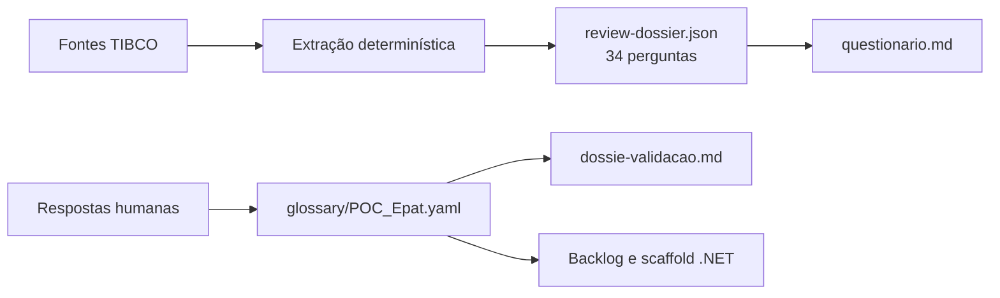

# Decisões de Migração — POC_Epat (TIBCO iProcess / AMX BPM → .NET)

**Documento para validação pela equipe de desenvolvimento e pelos mantenedores do ePAT.**

| Item | Valor |
|---|---|
| Pacote analisado | `POC_Epat` |
| Fonte principal | `POC_Epat.xpdl` (765 KB, 12.626 linhas, 9 processos, 215 atividades, 221 transições) |
| Fontes complementares | `EPAT.wsdl`, `DecisionsEPAT.wsdl`, `intimacoes_Parametros.ers`, 7 arquivos `.form`, 2 telas ASP.NET, documento da PoC |
| Total de questões levantadas | 34 |
| Questões já respondidas | 34 |
| Pontos que ainda dependem da SEFAZ | 6 |
| Data de referência | 2026-08-11 |

---

## 1. O que é este documento

A análise do pacote exportado do TIBCO foi feita de forma **mecânica**: scripts leem o XPDL, o WSDL, o Corticon, os formulários e o código das telas, e extraem fatos. Nenhuma ferramenta inventa significado de negócio.

Quando o pacote não permite decidir sozinho, a questão é registrada como pergunta em vez de ser resolvida por suposição. Foram 34 perguntas dessas. Todas receberam uma resposta registrada, e é **essa resposta que precisa ser conferida por vocês**.

Cada questão aqui tem cinco partes:

| Parte | O que significa |
|---|---|
| **Pergunta** | O que o pacote não conseguiu responder sozinho |
| **Evidência** | O trecho real do código legado, com arquivo e linha |
| **Por que não é trivial** | Qual construção do iProcess não tem equivalente direto em .NET |
| **Decisão registrada** | O que ficou decidido, e por quê |
| **Impacto na implementação** | O que o time .NET precisa fazer por causa disso |

### Onde as respostas ficam guardadas

As respostas **não** ficam neste documento. Elas vivem em [config/glossary/POC_Epat.yaml](config/glossary/POC_Epat.yaml), que é o único arquivo autorado por humanos no fluxo. Este documento é uma leitura desse arquivo, escrita para revisão.



### Distribuição das questões

| Prioridade | Significado | Quantidade |
|---|---|---:|
| **P1** | Construção sem equivalente em .NET, severidade alta | 3 |
| **P2** | Sem equivalente (média) ou bloqueador de política | 10 |
| **P3** | Comportamental: o ramo errado dispara sem erro visível | 10 |
| **P4** | Nomenclatura e rótulos | 11 |

---

## 2. Prioridade P1 — sem equivalente em .NET, alto risco

### 2.1 Subprocesso dinâmico (`gaps.dynamic-subprocess`)

**Pergunta:** como reproduzir, em .NET, uma chamada de subprocesso cujo destino só é conhecido em tempo de execução?

**Evidência.** O XPDL não aponta para um processo; aponta para um **campo do caso** que contém o nome do processo.

Em [POC_Epat.xpdl](input/Arquivos%20Poc%20Camunda/POC_Camunda/POC_Epat/Process%20Packages/POC_Epat.xpdl), linha 1356:

```xml
<xpdl2:SubFlow Id="_jbIH91qjEfG5K7mY0I3I6w" xpdExt:ProcessIdentifierField="DEAT0050"/>
```

Linha 2723 (atividade *Controlar Intimados*, declarada na linha 2721):

```xml
<xpdl2:SubFlow Id="_BAx4zV6KEfGBBLgT-R5iuw" xpdExt:ProcessIdentifierField="NRSUBPRO">
```

Linha 8674 (atividade *Aguardar Retorno*, do processo `CONTROPC`, declarada na linha 8672):

```xml
<xpdl2:SubFlow Id="__BAVLV6QEfGlneRUZ2ZhXA" xpdExt:ProcessIdentifierField="AGUARDAR">
```

E, agravante, nas três ocorrências (linhas 1366, 2844 e 8741):

```xml
<iProcessExt:DynamicSubProcessTask IsGraftStep="false" HaltOnBadSubProcess="false" .../>
```

`HaltOnBadSubProcess="false"` significa: **se o processo de destino não existir, o legado não para — ele falha em silêncio.**

**Por que não é trivial.** Em C#, o tipo a instanciar precisa ser conhecido em compilação. Escolher o destino por valor de dado normalmente significa abrir mão da verificação em build.

**O que foi descoberto e mudou a análise.** O `SubFlow` não aponta para um processo solto: aponta para uma `xpdExt:ProcessInterface`. Existem exatamente três no pacote:

| Interface | Linha da declaração | Implementada por | Linha do `ImplementedInterface` |
|---|---:|---|---:|
| `NOTFAIIM` | 12028 | `DEAT0050` | 4155 |
| `CTRINTPC` | 12179 | `CONTROPC` | 8972 |
| `AGURETPC` | 12463 | `AGPECASPC` | 10853 |

Ou seja, **o TIBCO já tem o conceito de interface**. A tradução para C# é transcrição, não invenção.

**Decisão registrada:** `interface-registry-validated`.

Uma interface C# por `ProcessInterface`, uma implementação por processo que a declara, resolução em runtime por chave (DI com chave do .NET 8), e **o registro é gerado a partir do XPDL e validado na inicialização da aplicação**.

**Ressalva importante que ficou registrada.** O campo `AGUARDAR` recebe sete valores diferentes no script `ISetSubProc` do `CONTROPC` (linha 8554), mas apenas uma implementação de `AGURETPC` foi entregue:

```javascript
AGUARDAR[0] = "AgPRJ";      // implementação não entregue
AGUARDAR[0] = "AgRecPRJ";   // implementação não entregue
AGUARDAR[0] = "AgPRJR";     // implementação não entregue
AGUARDAR[0] = "AgPecas";    // única entregue (AGPECASPC)
AGUARDAR[0] = "AgRCRaz";    // implementação não entregue
AGUARDAR[0] = "AgCRaz";     // implementação não entregue
AGUARDAR[0] = "AgPetica";   // implementação não entregue
```

O conjunto de destinos **não é fechado**. Por isso a opção `closed-switch` (um `switch` fixo) foi recusada: ela quebraria assim que um pacote externo trouxesse um destino novo.

**Impacto na implementação.**

- Gerar o registro de processos a partir do XPDL, não escrevê-lo à mão.
- Validar o registro na inicialização: destino sem implementação **quebra o teste de inicialização**, nunca a produção.
- Não herdar o `HaltOnBadSubProcess="false"`: a falha precisa ser visível.

---

### 2.2 Graft Step (`gaps.graft-step`)

**Pergunta:** o passo pai realmente espera que múltiplos filhos se anexem a ele, ou é uma chamada simples de subprocesso?

**Evidência.** A flag exportada diz uma coisa, e a descrição escrita pelo próprio autor do processo diz outra. Atividade `_0XWagVqNEfG5K7mY0I3I6w`, *Aguardar evento de Notificacao do AIIM*, na linha 1350:

```xml
<xpdl2:Description>Esta atividade tem como objetivo esperar que todos os processo de
Notificação de AIIM sejam concluídos, sejam as notificações do AIIM original ou
Notificações de versões de retiratificação de AIIM.

Solução técnica:
Este chamada de sub-processo está marcada como Graft Step. Isto significa que esta
chamada não incia os sub-processos e sim aguarda que os sub_processo sejam vinculados
a esta atividade para que ela possa dar prosseguimento ao processo ao término de todos
os sub-processos. Isto permite que sub-processo sejam iniciados em momentos diferentes
utilizando a mesma chamada.</xpdl2:Description>
```

Mas na linha 1366, dentro da mesma atividade:

```xml
<iProcessExt:DynamicSubProcessTask IsGraftStep="false" .../>
```

**A descrição do autor descreve exatamente um graft step, e a flag exportada diz `false`.** A avaliação registrada é que a flag é artefato da exportação, não intenção — reforçada pelo fato de os campos envolvidos serem `IsArray="true"`, o que confirma cardinalidade múltipla (um filho por solidário).

**Por que não é trivial.** A junção é invertida: o pai não sabe quantos filhos existirão nem quando aparecerão. O padrão clássico de fan-out/fan-in exige conhecer o conjunto no momento da divisão.

**Decisão registrada:** `correlation-join`.

O pai suspende em um *bookmark* correlacionado pelo caso; cada filho, ao terminar, sinaliza; um contador de filhos registrados decide o encerramento. O contrato fica **do lado do pai** — o filho apenas sinaliza —, o que evita obrigar processos de pacotes externos a se registrarem.

Foi decidido também que as duas válvulas de reinício manual ficam **em escopo**, por serem hoje o único mecanismo de recuperação do graft:

| Atividade | Linha | Tipo |
|---|---:|---|
| *Iniciar Aguardar Notificacao* | 1370 | `TaskReceive` |
| *Iniciar Novo Graft* | 3032 | `TaskReceive` |

O trecho da linha 1370 mostra o porquê, nas palavras do autor:

```xml
<xpdl2:Description>Após ocorrência de erros de tela e procedimento humano, foi incluído
esta atividade para possibilidatar o reinício do "Aguardar evento de Notificação do AIIM".</xpdl2:Description>
```

**Impacto na implementação.** Ainda **por definir**, e é uma das perguntas para vocês:

- a chave de correlação formal;
- o critério de encerramento;
- o timeout para um filho que nunca termina.

Hoje os três são implícitos na identidade do caso do iProcess.

---

### 2.3 Builtins do iProcess e o sentinela `SW_NA` (`gaps.iprocess-builtin`)

**Pergunta:** como representar em C# um valor que não é nulo, não é vazio, e significa "não disponível"?

**Evidência.** `SW_NA` aparece em 17 pontos, em 9 processos. O exemplo mais claro está no script *prepSub* do `POC_EpatProcess` (linha 2848):

```javascript
if (CODUADTJ == IPESystemValues.SW_NA){
    CODUADTJ = CODUADRT;
}

if(CNTPECA1 != IPESystemValues.SW_NA){
    IDPECASCNT = CNTPECA1;}

if(CNTPECA2 != IPESystemValues.SW_NA){
    IDPECASCNT = IDPECASCNT + '|' + CNTPECA2;}
```

E no script *Verificar Anulacao* (linha 1895), onde o sentinela é convertido explicitamente em literal de domínio:

```javascript
if(ORIGEM == IPESystemValues.SW_NA){
    ORIGEM = 'NA';
}
```

Esse último trecho é uma prova direta: o próprio legado precisa transformar o terceiro estado em um valor concreto para poder trafegá-lo.

**Por que não é trivial.** São 18 campos que usam `SW_NA`. Mapear para `null` colapsa dois estados diferentes em um só, e o ramo que dispara muda **sem erro de compilação e sem teste vermelho**.

**Decisão registrada:** `shim-tri-state`.

Um tipo próprio na camada anticorrupção, com três estados — `HasValue`, `IsNotAvailable`, `Empty` — de modo que o `pattern matching` exaustivo do C# obrigue o desenvolvedor a tratar os três casos.

As alternativas foram recusadas com motivo:

| Opção | Por que foi recusada |
|---|---|
| `map-to-null` | Exigiria provar, campo a campo, que nenhum dos 18 é legitimamente nulo. Onde a prova falhasse, o ramo trocado não daria erro visível. |
| `preserve-literal` | Propagaria tipagem fraca para todo o modelo de domínio e abriria mão da verificação do compilador. |

**Impacto na implementação.** O tipo tri-estado já está previsto no esqueleto gerado, em [artifacts/POC_Epat/scaffold/src/SefazSp.Epat.Domain/ValueObjects/FieldValue.cs](artifacts/POC_Epat/scaffold/src/SefazSp.Epat.Domain/ValueObjects/FieldValue.cs).

---

## 3. Prioridade P2 — bloqueadores e lacunas de política

### 3.1 Semântica dos builtins não confirmada (`rulings.BUILTIN-SEMANTICS`)

**Pergunta:** `SUBSTR` e `SEARCH` do iProcess são base 1 ou base 0?

**Evidência.** O laço que alimenta o graft step depende inteiramente disso. Script *prepSub*, linha 2848:

```javascript
POSICAOINICIO = 0;
POSICAOFIM = 0;
AUX = IDSINTIMADOS;
for(INDICESUBDIN = 0; INDICESUBDIN <= QTDINTIMADOS-1; INDICESUBDIN ++) {
    NRSUBPRO[INDICESUBDIN] = "CONTROLE";
    POSICAOFIM = IPEStringUtil.SEARCH("|",AUX);
    ARRAYINT[INDICESUBDIN]=IPEStringUtil.SUBSTR(AUX,1,POSICAOFIM-1);
    POSICAOINICIO = POSICAOFIM+1;
    FIMSTRING = IPEStringUtil.STRLEN(AUX);
    AUX = IPEStringUtil.SUBSTR(AUX,POSICAOINICIO,FIMSTRING);
}
```

**Por que não é trivial.** Não há TIBCO em execução nem documentação do fornecedor na entrega. Existe apenas um indício: o próprio script carrega um dado literal, `'278713|278712|'`, e com ele o laço **só fecha se os índices forem base 1**:

| Hipótese | `SEARCH("|", ...)` | `SUBSTR(x,1,pos-1)` | Resultado |
|---|---:|---|---|
| Base 1 | 7 | `SUBSTR(x,1,6)` | `278713` ✔ |
| Base 0 | 6 | `SUBSTR(x,1,5)` | `27871` ✘ perde um dígito |

Isso é **indício, não prova**: assume que o script original está correto.

**Decisão registrada:** não assumir base 1 por inferência. Consultar a documentação TIBCO iProcess e fixar a semântica por escrito **antes** de implementar.

Três pontos precisam ser fixados:

1. `SUBSTR` e `SEARCH` são base 1 ou base 0?
2. O terceiro argumento de `SUBSTR` é **comprimento** ou **posição final**? As duas chamadas existentes não distinguem os casos.
3. O que `SEARCH` retorna quando o separador não existe, e o que `SUBSTR` faz com comprimento negativo?

**Impacto na implementação.** Isso **bloqueia** o `prepSub`, que é o script que alimenta o graft step. Um desvio de uma posição em `SUBSTR` não gera exceção: gera um identificador truncado que segue pelo fluxo. É a classe de defeito mais difícil de detectar depois, porque não falha — apenas mente.

---

### 3.2 Divergência no PRPINTPC (`rulings.CLONE-PRPINTPC`)

**Pergunta:** por que um dos cinco subprocessos de serviço testa erro de um jeito diferente dos outros quatro?

**Evidência.** Cinco processos (`CALCPRPC`, `BSCENVPC`, `PRPINTPC`, `ATZINTPC`, `CRNOTPC`) são cópias do mesmo template de chamada de serviço com retry. Quatro testam:

```javascript
STATUS_CODE != "0";
```

Só o `PRPINTPC` testa, na linha 7322:

```xml
<xpdl2:Expression ScriptGrammar="JavaScript">STATUS_CODE!=IPESystemValues.SW_NA;</xpdl2:Expression>
```

O gateway correspondente está na linha 7076.

**Por que importa.** A condição está **invertida em relação ao propósito**. No `PRPINTPC`, um `STATUS_CODE = '0'` (sucesso) é diferente de `SW_NA`, portanto dispara o ramo de erro. E como esse template concentra o tratamento de erro e retentativa de todas as chamadas de serviço, a divergência muda a política de erro de uma integração inteira.

**Decisão registrada:** defeito de cópia. Corrigir na migração para `STATUS_CODE != '0'`, alinhando com os quatro irmãos, e reportar à SEFAZ para correção na origem.

A justificativa registrada observa que os cinco gateways têm forma idêntica — ramo *Good* sem condição (default) e ramo *AppError* para *Set App Error* — e que só a condição difere, em apenas um deles.

**Atenção na demonstração.** Corrigir **muda comportamento observado**: casos que hoje passam em silêncio com erro passarão a parar. Isso precisa de nota explícita durante a apresentação.

---

### 3.3 Rótulo apontando para outro campo (`rulings.LABEL-CONFLICT`)

**Pergunta:** qual é o nome de negócio correto de dois campos cujo rótulo no formulário é o nome de **outro** campo?

**Evidência.**

| Campo | Rótulo no formulário | Problema |
|---|---|---|
| `NR_RATORIG` | `NR_RAT` | É o nome de outro campo existente |
| `STSPETICAO` | `StatusPeticao` | Colide com o campo `STATUSPETICAO`, que também existe |

**Por que não é trivial.** Aceitar o rótulo renomearia o campo errado no modelo .NET. O código compilaria, os testes passariam, e a tela mostraria um rótulo que descreve outro dado.

**Decisão registrada:** recusar os dois rótulos e nomear por dedução a partir do próprio identificador:

- `NR_RATORIG` → "Número do RAT original"
- `STSPETICAO` → "Status da Petição"

**Pendente de ratificação pela SEFAZ.** São deduções, não confirmação.

---

### 3.4 Prazo por expressão (`gaps.expression-deadline`)

**Pergunta:** o prazo é uma duração ou um instante absoluto? E o que acontece se o campo de data mudar depois do agendamento?

**Evidência.** O prazo não é uma duração: é um **par de campos do caso**. Atividade *Aguarda Defesa*, `DEAT0050`, linha 3872:

```xml
<xpdl2:Deadline>
  <xpdl2:DeadlineDuration ScriptGrammar="JavaScript">PRAZODEFESA;
PRAZODEFESAT;
</xpdl2:DeadlineDuration>
</xpdl2:Deadline>
```

Atividade *Fim de Prazo Mantendo Atividade*, `POC_EpatProcess`, linha 2269:

```xml
<xpdl2:Deadline>
  <xpdl2:DeadlineDuration ScriptGrammar="JavaScript">DTFIMCQ;
HRFIMCQ;</xpdl2:DeadlineDuration>
</xpdl2:Deadline>
```

E os campos são preenchidos por script. *Set Nome Etapa 2*, logo após a linha 2290:

```javascript
NOMEETAPA = "CQ";
DAYSOVER = 0;
DTFIMCQ = IPESystemValues.SW_DATE;
HRFIMCQ = IPEDateTimeUtil.CALCTIME('23:59',0,0,DAYSOVER);
```

**Decisão registrada:** `absolute-instant`. Combinar data e hora em um `DateTime` absoluto no momento do agendamento.

Vale registrar o histórico: `recompute-on-resume` chegou a ser escolhido e foi revertido no mesmo dia, porque obrigava a definir uma política para o instante recalculado que já passou (dispara? ignora? escala?), e essa política **não existe no legado nem no documento da PoC** — teria de ser inventada em código.

**Risco residual assumido:** o timer não acompanha prorrogação de prazo feita depois do agendamento.
**Mitigação a implementar:** rearmar o temporizador sempre que o campo de prazo for escrito.

**Descoberta relevante para a validação.** Todos os 9 processos declaram, por exemplo na linha 12020:

```xml
<iProcessExt:ProcessProperties UseWorkingDays="true" ... />
```

Isso significa que o motor iProcess está configurado para contar **dias úteis**. Precisamos confirmar se isso afeta o cálculo destes prazos, e qual calendário de feriados é usado. Em processo administrativo fiscal, um prazo que dispara cedo ou tarde tem consequência legal, não apenas técnica.

**Ainda por confirmar:** fuso horário (assumido `America/Sao_Paulo`) e o efeito de `UseWorkingDays`.

---

### 3.5 Evento externo (`gaps.external-event`)

**Pergunta:** como o processo é retomado quando algo de fora acontece?

**Evidência.** Seis pontos esperam por evento externo:

| Processo | Atividade | Linha |
|---|---|---:|
| `AGPECASPC` | Aguardar Interposicoes | 10506 |
| `DEAT0050` | INICALC | 3982 |
| `POC_EpatProcess` | Iniciar Aguardar Notificacao | 1370 |
| `POC_EpatProcess` | Iniciar Novo Graft | 3032 |
| `POC_EpatProcess` | Pedido de Vistas | 1535 |
| `POC_EpatProcess` | Vistas do Juiz | 1608 |

**Decisão registrada:** `bookmark-correlation`. Usar o modelo de longa duração do próprio motor de workflow, sem infraestrutura adicional. `queue-saga` foi revertida por exigir mensageria fora do escopo declarado da PoC.

**A chave de correlação já existe e não precisa ser inventada.** Ela é montada pelo próprio legado antes de cada chamada. Script *SetParameters* do `BSCENVPC`, linha 5832 — e idêntico nos cinco subprocessos de serviço:

```javascript
if(IDPROCESSO != IPESystemValues.SW_NA){
    PROCESS_ID = 'idAiim-'+IPEConversionUtil.STR(IDAIIM,0)+'idProc-' + IPEConversionUtil.STR(IDPROCESSO,0);
} else {
    PROCESS_ID = 'idAiim-'+IPEConversionUtil.STR(IDAIIM,0)+'idProc-NA';
}
if (MAXRETRIES==null) {
   MAXRETRIES=5;
}
```

**Ainda por definir:**

- proteção do endpoint de retomada;
- política de idempotência para entrega duplicada ou resposta atrasada.

O teste de evento duplicado é exigido pela etapa 5 do plano de cumprimento. Sem idempotência, uma entrega duplicada faz o caso avançar duas vezes — e, com o graft step envolvido, pode gerar notificações a mais.

---

### 3.6 Link / GOTO (`gaps.link-goto`)

**Pergunta:** os saltos entre raias devem virar aresta explícita ou evento de sinal?

**Evidência.** São 20 ocorrências, 10 pares `throw`/`catch`. Exemplo na linha 1338, atividade *Inicia Graft Step*:

```xml
<xpdl2:IntermediateEvent Trigger="Link">
  <xpdl2:TriggerResultLink CatchThrow="CATCH" Name="0"/>
</xpdl2:IntermediateEvent>
```

**Decisão registrada:** `flatten-edge`. Achatar cada par em uma aresta explícita de fluxo. Os 10 pares já estão resolvidos na extração e nenhum atravessa fronteira de processo.

`keep-as-signal` foi recusada por introduzir pontos de persistência e espera que o TIBCO não tem: o motor passaria a parar onde o original não parava.

**Impacto na implementação.** Esta é a classe de omissão mais fácil de cometer: no XPDL esses saltos **não existem como transição**. Se não forem escritos explicitamente no fluxo .NET, o processo se parte em dois sem erro aparente. Por isso cada card do backlog marca como o passo foi alcançado (`entrouPor`).

---

### 3.7 Fronteira não interruptiva (`gaps.non-interrupting-boundary`)

**Pergunta:** o aviso de fim de prazo deve cancelar a atividade em andamento?

**Evidência.** Existe exatamente **uma** dessas no pacote. Linha 2269:

```xml
<xpdl2:TriggerTimer xpdExt:ContinueOnTimeout="true">
```

Compare com o timer do `DEAT0050`, linha 3872, que é interruptivo:

```xml
<xpdl2:TriggerTimer xpdExt:ContinueOnTimeout="false">
```

**Decisão registrada:** `parallel-branch`. Ramo lateral paralelo dentro do mesmo escopo, sem cancelar a atividade hospedeira.

`external-subscription` foi revertida porque, com ela, o ramo lateral **deixa de aparecer no diagrama** — e a rastreabilidade visual é objetivo declarado da PoC. Um comportamento que funciona mas não se vê não serve para demonstrar aderência funcional.

**Ainda por confirmar com o negócio:** quem recebe o aviso, e se a atividade hospedeira pode mesmo terminar normalmente depois de o aviso ter disparado.

**Risco se errado:** implementar como interruptiva cancela trabalho em andamento quando o prazo passa — perda de trabalho do usuário.

---

### 3.8 Valores fixos embutidos em script (`rulings.SCRIPT-HARDCODED`)

**Pergunta:** cada valor fixo é andaime de teste (remover) ou parâmetro legítimo (externalizar)?

Foram tratados **um a um**, porque a resposta é diferente para cada.

#### (1) `IDSINTIMADOS` — REMOVER

Última linha do script *prepSub* (linha 2848):

```javascript
IDSINTIMADOS = '278713|278712|';
/*--278711|278710|278709|278708|278707|278706|278705|278704|278703|278702|278701|278700|
    278699|278698|278697|278696|278695|278694|278693|278692|278691|';*/
```

A atribuição está **depois** do laço que consome a lista, portanto não afeta a execução corrente, mas contamina a próxima. Ao lado há um comentário com mais vinte identificadores que alguém foi cortando: é o registro de uma sessão de testes.

**Uso positivo:** essa lista é um oráculo pronto. `'278713|278712|'` com `QTDINTIMADOS = 2` é um caso ideal para validar o graft step com dois filhos.

**Se fosse reproduzido fielmente:** toda a demonstração notificaria sempre os mesmos dois solidários, independentemente do AIIM — e o graft step, conceito de destaque da PoC, seria demonstrado com dados falsos.

#### (2) Destinatários de e-mail — EXTERNALIZAR

Script *Define Destinatarios*, linha 2657:

```javascript
if (IPESystemValues.SW_HOSTNAME == 'prod1'){
    CCRELATORIO='acsimoes@fazenda.sp.gov.br';
    BCCRELATORIO='epat_tribunal@fazenda.sp.gov.br';
}
else {CCRELATORIO=IPESystemValues.SW_NA;
    BCCRELATORIO=IPESystemValues.SW_NA;}
```

Observe que o script **já é configuração por ambiente feita à mão**: testa o nome da máquina. Além disso, `acsimoes@` é o endereço nominal de uma pessoa — se ela sair, o processo deixa de avisar quem deveria.

**Decisão:** passar a configuração por ambiente, que é exatamente o que o autor tentou fazer.

#### (3) `STATUSSUBPROC = 'inativo'` — MANTER

Passo de uma linha só, no `CONTROPC`. É transição de estado do domínio, não andaime. **Nota para a implementação:** `'inativo'` deve virar valor de enumeração, não string literal.

#### (4) Atalho de prazo em ambiente de desenvolvimento — REMOVER

Encontrado depois, no script *HoraFimSC* do `DEAT0050` (linha 3895):

```javascript
DAYSOVER = 0;
PRAZODEFESAT = IPEDateTimeUtil.CALCTIME('23:59',0,0,DAYSOVER);

if (IPESystemValues.SW_HOSTNAME == 'des1')
{
    PRAZODEFESA = IPESystemValues.SW_DATE ;
    PRAZODEFESAT = IPEDateTimeUtil.CALCTIME(IPESystemValues.SW_TIME,1,0,DAYSOVER);
}
```

Isso encurta o prazo de defesa para daqui a uma hora quando roda na máquina `des1`. **Decisão: remover.** A demonstração usa relógio controlável nos testes, não prazos encurtados por nome de máquina.

---

### 3.9 Pacotes externos não entregues (`rulings.MISSING-EXTERNAL-PACKAGES`)

**Pergunta:** a SEFAZ pode entregar os pacotes referenciados? E para os que não vierem, o que fazer?

**Evidência.** O XPDL referencia **15 pacotes externos** cujos arquivos nunca foram entregues: `NotificacaoAIIM`, `EPAT_SEGUNDA`, `EPAT_SEGUNDA1`, `GERAL`, `Decisions`, `Calendario`, `EPAT IPROCESS`, `EPAT`, `Process`, `GED`, `GED2`, `iProcess`, `Intimacao`, entre outros.

**Decisão registrada:** substituir por dublês com contrato acordado, sem esperar pelos arquivos. Cada dublê é tipado a partir do WSDL ou da `ProcessInterface` correspondente e é conduzido por cenário.

Isso **não é lacuna de análise, é lacuna de entrega** — nenhuma análise adicional a resolve.

**Consequência a assumir.** Ficou confirmado que os 6 destinos faltantes de `AGUARDAR` (`AgPRJ`, `AgRecPRJ`, `AgPRJR`, `AgRCRaz`, `AgCRaz`, `AgPetica`) estão nesses pacotes. São, portanto, **6 dublês a construir**, além do `AGPECASPC` entregue.

**Regra explícita:** não silenciar a falha. O legado declara `HaltOnBadSubProcess="false"`; a migração não deve herdar isso.

---

### 3.10 Tipo divergente entre XPDL e formulário (`rulings.TYPE-XPDL-VS-FORM`)

**Pergunta:** quando o XPDL e o formulário discordam sobre o tipo, qual prevalece?

**Evidência.** Em 14 campos, a precisão declarada no XPDL implica 64 bits, mas o formulário `.form` declara `BomPrimitiveTypes::Integer` (32 bits):

| Campos | Precisão |
|---|---|
| `SW_CASENUMPOC`, `SW_MAINCASEPOC` | 15 |
| `IDAIIM`, `NR_AIIM`, `NR_RAT`, `NR_RATORIG`, `IDAIIMORIGINAL`, `NRAIIM` | 11 |
| `QTDINTIMADOS`, `CDIMPOSTO`, `INDICESUBDIN`, `POSICAOINICIO`, `POSICAOFIM`, `FIMSTRING` | 10 |

**Decisão registrada:** a precisão do XPDL prevalece. Os 14 campos passam a `long` (`Int64`). **Sem exceções.**

O raciocínio é de padrão único, não campo a campo: alargar nunca trunca; estreitar trunca em silêncio. O caso decisivo é `SW_CASENUMPOC`, com precisão 15, que não cabe em `Int32` de forma nenhuma.

**Consequência.** O contrato com a tela ASP.NET muda, porque o formulário `REALATVI` declara `Integer`. A conversão precisa ser explícita na fronteira, e um valor que não couber deve falhar de forma visível em vez de truncar.

---

## 4. Prioridade P3 — comportamento

### 4.1 Os quatro ramos com sentinela

Estes são os pontos onde `SW_NA` decide para onde o caso vai. Errar aqui não gera erro de compilação.

#### `TIPOVISTAS` — regra de negócio real, preservar

Condição na linha 3183:

```xml
<xpdl2:Expression ScriptGrammar="JavaScript">TIPOVISTAS=='JUIZ' || TIPOVISTAS == IPESystemValues.SW_NA;</xpdl2:Expression>
```

E os ramos irmãos, nas linhas 3279 e 3291:

```xml
<xpdl2:Expression ScriptGrammar="JavaScript">TIPOVISTAS=='MISTA';</xpdl2:Expression>
```

**Decisão registrada:** é **intencional e deve ser preservado**. Tipo de vista igual a `JUIZ` **ou** não informado segue o caminho de *Vistas do Juiz*.

Ponto importante: o ramo alternativo, rotulado `DRF`, é o ramo por omissão e significa "tudo o que não é `JUIZ`", incluindo `MISTA`. **`DRF` não é um terceiro valor do domínio** — o domínio observado em todo o pacote é apenas `{JUIZ, MISTA}`.

**Por que isso prova a necessidade do tipo tri-estado:** colapsar `SW_NA` em `null` faria o caso cair no ramo `DRF` em vez do ramo do juiz, invertendo a regra sem erro visível.

#### `DATACONTROLE` em `AGPECASPC` e `DEAT0050` — primeira volta do laço

Condições:

```javascript
DATACONTROLE == IPESystemValues.SW_NA || DATACONTROLE != PRAZORECEBIMENT;   // AGPECASPC
DATACONTROLE == IPESystemValues.SW_NA || DATACONTROLE != PRAZODEFESA;       // DEAT0050
```

**Decisão registrada:** `SW_NA` significa **primeira volta do laço de prazo** — ainda não se esperou por prazo nenhum. Segue junto com "prazo mudou", unido pelo `||`, exatamente como no legado.

O ciclo do `AGPECASPC` é: gateway → *SetPrazo* → *Aguardar Interposicoes* → *Controla Datas* → gateway. O passo *Controla Datas* faz `DATACONTROLE = PRAZORECEBIMENT`. Ou seja, `DATACONTROLE` guarda o prazo pelo qual **já se esperou**, e quando os dois coincidem o ciclo termina.

Se `SW_NA` saísse do ciclo em vez de entrar, o processo **nunca esperaria**, porque na primeira volta o campo está sempre vazio.

O ciclo do `DEAT0050` tem um passo a mais e revela algo importante: o `CALCPRPC` **recalcula** o prazo a cada volta, e se ele mudou o processo volta a esperar. É um laço de **prorrogação de prazo**.

> Isso valida a decisão tomada em `gaps.expression-deadline`: a mitigação "rearmar o temporizador quando o prazo mudar" não é invenção nossa — o legado já faz exatamente isso, voltando ao gateway e criando um timer novo.

#### `STATUS_CODE` em `PRPINTPC` — fechado por remissão

Não há decisão a tomar: a sentinela **desaparece** quando a condição for corrigida para `STATUS_CODE != '0'`, conforme decidido no item 3.2.

---

### 4.2 Os seis identificadores do envelope técnico

Estes campos não pertencem ao modelo de domínio. Eles são **contexto de execução do workflow**.

| Identificador | Termo registrado | Domínio | Origem |
|---|---|---|---|
| `ISAPPERROR` | Indicador de erro de aplicação | `'N'` / `'Y'` | Resposta do serviço |
| `ISTECHERROR` | Indicador de erro técnico | `'N'` / `'Y'` | Resposta do serviço |
| `MAXRETRIES` | Teto de tentativas | 5 por omissão | Configuração |
| `NUMAPPRETRIES` | Contador de tentativas de aplicação | inicia em 0 | Contexto de execução |
| `OUTCOME` | Decisão do operador na exceção | `'R'` / `'OK'` | Tarefa humana |
| `STATUS_CODE` | Código de retorno do serviço | `'0'` = sucesso | Envelope técnico |

**Evidência.** O script *Start Loop* do `BSCENVPC` (linha 5894) responde a quatro dessas perguntas de uma vez:

```javascript
if (NUMAPPRETRIES==null) {
   NUMAPPRETRIES=0;
}
else {
   NUMAPPRETRIES=NUMAPPRETRIES+1;
}
ISAPPERROR='N';
ISTECHERROR='N';
OUTCOME='OK';
DATETIME = IPEConversionUtil.DATESTR(IPESystemValues.SW_DATE);
```

E o *SetParameters* (linha 5832) responde à quinta: `MAXRETRIES = 5`, definido ali e não em pacote externo.

**Distinção crítica registrada.** `ISAPPERROR` e `ISTECHERROR` formam um par com propósitos opostos:

- **Erro de aplicação** = falha por regra de negócio. **Não** se resolve repetindo a chamada. Vai para tratamento manual.
- **Erro técnico** = falha de infraestrutura (fila, rede, indisponibilidade). **Esse sim** é retentável automaticamente.

Repetir automaticamente uma chamada que falhou por regra de negócio consome todas as tentativas sem chance de sucesso, e só atrasa a entrada em tratamento manual.

**Outra distinção:** `MAXRETRIES` é comparado contra **dois contadores independentes** — `NUMAPPRETRIES` (falhas de aplicação) e `IPESystemValues.SW_QRETRYCOUNT` (falhas de entrega da fila). Foi confirmado que são mesmo independentes e devem ser reproduzidos tal como estão. Se fossem tratados como um só por engano, o número real de tentativas em .NET poderia chegar ao dobro do pretendido.

**Nota de implementação para `STATUS_CODE`:** o valor nasce no envelope técnico da resposta do serviço, declarado no `EPAT.wsdl`. Ele precisa ser **copiado** do resultado da chamada para o contexto de execução em um passo explícito de mapeamento — não aparece lá sozinho.

---

## 5. Prioridade P4 — nomenclatura e rótulos

### 5.1 Rótulos de formulário não verificados (`rulings.LABEL-SUGGESTION`)

**Contexto essencial:** o iProcess corta nomes de campo em **15 caracteres**. O histograma de comprimento dos 209 campos tem pico exatamente em 15 (28 campos) — é prova de truncamento, não de estilo de nomenclatura.

Exemplos do que foi perdido:

| Identificador no XPDL | Nome completo recuperado |
|---|---|
| `IDDECISAODEBITO` | `idDecisaoDebitoFiscal` |
| `EXCLUSAOSOLIDAR` | `ExclusaoSolidarios` |
| `VICIOREPRESENTA` | `vicioRepresentacao` |
| `CNTINSTANCIASUF` | `cntInstanciasUFC` |
| `PRAZORETIRADAVI` | `PrazoRetiradaVista` |

**Decisão registrada:** aceitar em bloco os 21 rótulos do formulário como termo de negócio, corrigindo erros de escrita evidentes (por exemplo, `Contorle` → `Controle`). Havendo divergência futura, o vocabulário oficial da SEFAZ prevalece sobre o rótulo do formulário.

Risco baixo e reversível: renomear uma propriedade é refatoração mecânica. Os dois rótulos conflitantes do item 3.3 estão **excluídos** deste bloco.

### 5.2 Regra comentada divergente da ativa (`rulings.SCRIPT-COMMENTED-LOGIC`)

**Evidência.** No *prepSub* (linha 2848), a versão comentada é mais restritiva que a ativa:

```javascript
/*if (CNTPECA1=='110' || CNTPECA1=='24' || CNTPECA1=='53' || CNTPECA1=='55' || CNTPECA1=='22'){
   IDPECASCNT = CNTPECA1;}*/

if(CNTPECA1 != IPESystemValues.SW_NA){
    IDPECASCNT = CNTPECA1;}
```

A versão comentada filtrava por uma lista fechada de códigos. A ativa aceita **qualquer** valor diferente de `SW_NA`.

**Decisão registrada:** a regra **ativa** prevalece. O código comentado é histórico e não migra. A migração reproduz o que o sistema faz hoje, não o que fez em alguma versão anterior.

**Nota:** se a SEFAZ confirmar que a restrição deveria estar ativa, isso é uma **alteração de regra de negócio**, não um defeito de migração.

### 5.3 Controles `.ascx` não entregues (`rulings.SCREEN-MISSING-CONTROLS`)

Cinco controles referenciados pelas telas nunca foram entregues: `Pecas.ascx`, `Cabecalho_AIIM.ascx`, `AdicionarPecas.ascx`, `Cabecalho_AIIM_DEAT.ascx` e um quinto.

**Decisão registrada:** limitação assumida. O front-end está diferido para o MVP. A PoC valida a aderência funcional do motor BPM, não a interface.

O que interessa das telas **já foi extraído** e não depende dos `.ascx`: o contrato tela-processo (quais campos são escritos de volta no motor) e as 154 decisões do code-behind.

**Fica registrado:** qualquer regra que viva dentro desses controles **não foi analisada**.

### 5.4 Campo lido pela tela e ausente do dicionário (`rulings.SCREEN-UNDECLARED-FIELD`)

Um único campo, `CPFCNPJNOTIFICA`, é lido pela tela mas não está entre os 209 campos declarados.

Ele aparece declarado na `ProcessInterface` `NOTFAIIM`, dentro do bloco iniciado na linha 12028:

```xml
<xpdl2:FormalParameter Id="_jbIH-lqjEfG5K7mY0I3I6w" Name="CPFCNPJNOTIFICA" IsArray="false"
                       Mode="IN" Required="false" xpdExt:DisplayName="CPF/CNPJ Notificado">
  <xpdl2:DataType><xpdl2:BasicType Type="STRING"><xpdl2:Length>18</xpdl2:Length></xpdl2:BasicType></xpdl2:DataType>
  <xpdl2:Description>Idenficador do CPF ou CNPJ do contribuinte.</xpdl2:Description>
</xpdl2:FormalParameter>
```

**Decisão registrada:** limitação assumida, pela mesma razão do item anterior. Não bloqueia nenhuma das sete etapas da PoC.

### 5.5 Os sete gateways sem rótulo (`decisions.*`)

Sete gateways do XPDL não têm nome. Como o diagrama BPMN precisa mostrar a pergunta que está sendo feita, cada um recebeu uma pergunta em linguagem de negócio, derivada da evidência do grafo — o que entra no gateway e para onde vão os ramos.

| Processo / Gateway | Pergunta registrada |
|---|---|
| `AGPECASPC` / `_EvOwVF6eE` | Já se esperou pelo prazo em vigor? |
| `DEAT0050` / `_lrer_VqhE` | Já se esperou pelo prazo em vigor? |
| `ATZINTPC` / `_RNdKGl6PE` | A chamada a *AtualizarIntimacao* foi bem sucedida? |
| `BSCENVPC` / `_qIDu4l6BE` | A chamada a *Busca Envolvidos Vista Por AIIM* foi bem sucedida? |
| `CALCPRPC` / `_zJIuclqiE` | A chamada a *CalcularPrazo* foi bem sucedida? |
| `CRNOTPC` / `_NcJxLl9KE` | A chamada a *CriaNotificacao* foi bem sucedida? |
| `PRPINTPC` / `_KEwDVl6EE` | A chamada a *CaptaParametros* foi bem sucedida? |

> O rótulo do `PRPINTPC` descreve o comportamento **já corrigido** conforme o item 3.2.

---

## 6. O que ainda depende de vocês

Estes seis pontos **não estão no pacote exportado**. Nenhuma análise adicional os resolve.

| # | Assunto | O que precisamos | Onde ver no TIBCO |
|---|---|---|---|
| 1 | **Semântica dos builtins** | `SUBSTR`/`SEARCH` são base 1 ou base 0? O 3º argumento de `SUBSTR` é comprimento ou posição final? O que `SEARCH` retorna quando não encontra? | *prepSub*, linha 2848 |
| 2 | **Graft step** | Quantos filhos podem se ligar a um pai? O que acontece se um nunca terminar? Qual a chave de correlação formal? | linhas 1338, 1350, 3032 |
| 3 | **Prazo por expressão** | Fuso horário e efeito de `UseWorkingDays="true"` (linha 12020 e outras 8). Qual calendário de feriados? | linhas 3872, 2269 |
| 4 | **Evento externo** | Proteção do endpoint de retomada e política de idempotência para entrega duplicada | linhas 10506, 3982, 1370, 3032 |
| 5 | **Fronteira não interruptiva** | Quem recebe o aviso? A atividade hospedeira pode mesmo terminar normalmente depois? | linha 2269 |
| 6 | **Rótulos deduzidos** | Confirmar `NR_RATORIG` = "Número do RAT original" e `STSPETICAO` = "Status da Petição" | campos `NR_RATORIG`, `STSPETICAO` |

---

## 7. Defeitos encontrados no pacote

Isto não é crítica ao trabalho de ninguém: é o que aparece quando se lê 765 KB de XPDL por máquina. Vale confirmar se já são conhecidos e se algum já foi corrigido em produção após esta exportação.

### 7.1 Divergência de inicialização entre os cinco clones

O script *Start Loop* é idêntico nos cinco subprocessos de serviço **exceto** por uma linha:

| Processo | Linha | Valor inicial |
|---|---:|---|
| `CALCPRPC` | 4811 | `OUTCOME='OK'` |
| `BSCENVPC` | 5906 | `OUTCOME='OK'` |
| `PRPINTPC` | 7441 | `OUTCOME='R'` |
| `ATZINTPC` | 9696 | `OUTCOME='R'` |
| `CRNOTPC` | 11554 | `OUTCOME='R'` |

Isso importa porque `OUTCOME` é comparado com `'OK'` e `'R'` em condições de desvio. **É intencional?**

### 7.2 Ordem de avaliação no `ISetSubProc`

Script do `CONTROPC`, linha 8554. As atribuições **não são mutuamente exclusivas**: os blocos são avaliados em sequência e um valor posterior sobrescreve o anterior. A ordem importa, exatamente como nas colunas do Corticon.

O caso mais grave é o último bloco:

```javascript
//if (Instancia==2 || vicioRepresentacao == true || (Instancia == 1 && defesaAdmitida == false && diligencia!=true) ){
if (NOVOMODELO == true) {
    AGUARDAR[0] = "AgPecas";
    PROCRETORNO = AGUARDAR[0];
}
```

É um **interruptor global que anula toda a tabela de decisão acima dele**.

No mesmo script há ainda um comentário do próprio autor admitindo pendência:

```javascript
//falta implementar regras para PRJ
```

E `IDDECISAODEBITO == 0` é testado, mas a legenda escrita pelo autor no topo do script só documenta 1, 2 e 3:

```javascript
//iddeciaodebito
// 1 mantido
// 2 reduzido
// 3 cancelado
```

Ou seja, **o valor 0 é usado em decisão mas não tem significado declarado**.

### 7.3 Bloco sem efeito no `Verificar Anulacao`

Linha 1895:

```javascript
if(INDNAORECORRER == true){
    INDNAORECORRER = true;
}else if(INDNAORECORRER == false){
    INDNAORECORRER = false;
}else{
    INDNAORECORRER = false;
}
```

Os dois primeiros ramos atribuem o valor a si próprio. **O único efeito real é o `else`**: quando `INDNAORECORRER` não é nem `true` nem `false` — isto é, quando está em `SW_NA` — força `false`.

### 7.4 Parsing frágil de lista

No *prepSub*, a quebra da lista separada por `|` não trata lista vazia nem ausência do separador final. Além disso, as listas de peças usam concatenação de string com `|`:

```javascript
IDPECASCNT = IDPECASCNT + '|' + CNTPECA2;
```

No modelo .NET isso provavelmente deve ser uma coleção, não uma string.

### 7.5 Duplicação de script

O *SetParameters* se repete **idêntico** em `CALCPRPC`, `BSCENVPC`, `PRPINTPC`, `ATZINTPC` e `CRNOTPC`. O mesmo vale para o *Start Loop*, com a divergência apontada em 7.1.

---

## 8. O que ficou fora do escopo da PoC

A prova de conceito não migra o ePAT inteiro: valida um cenário representativo de sete etapas.

| Tipo | Dentro | Total | Motivo da exclusão |
|---|---:|---:|---|
| Campos | 147 | 209 | Campo que ninguém lê nem escreve não tem comportamento a demonstrar. Continua no dicionário como fato do legado, mas não gera trabalho. |
| Operações de serviço | 5 | 127 | O WSDL descreve a superfície inteira do ePAT. O cenário toca uma fração dela. |
| Regras | 185 | 307 | Backend e frontend diferidos para o MVP por decisão do cliente. |

**Confirmar:** nada aqui é essencial ao cenário que será demonstrado?

---

## 9. Como registrar a conferência

Para cada item das seções 2 a 5, marque:

- [ ] **Confere** — a decisão reproduz o comportamento real do sistema
- [ ] **Não confere** — e uma frase dizendo o que é na realidade

Para os seis pontos da seção 6, precisamos de resposta, não de conferência.

Para a seção 7, indique se o defeito já é conhecido e se já foi corrigido em produção.

### Documentos relacionados

| Documento | Conteúdo |
|---|---|
| [artifacts/POC_Epat/questionario.md](artifacts/POC_Epat/questionario.md) | As 34 perguntas originais, com todas as opções que foram consideradas e recusadas |
| [artifacts/POC_Epat/dossie-validacao.md](artifacts/POC_Epat/dossie-validacao.md) | Versão em checklist, ordenada por risco, para os mantenedores do TIBCO |
| [config/glossary/POC_Epat.yaml](config/glossary/POC_Epat.yaml) | As respostas registradas, com justificativa completa. É a fonte deste documento |
| [artifacts/POC_Epat/review-dossier.json](artifacts/POC_Epat/review-dossier.json) | Versão legível por máquina, com toda a evidência de grafo |

### Quem revisou

| Nome | Papel | Área | Data | Itens revisados |
|---|---|---|---|---|
|  |  |  |  |  |
|  |  |  |  |  |
|  |  |  |  |  |
