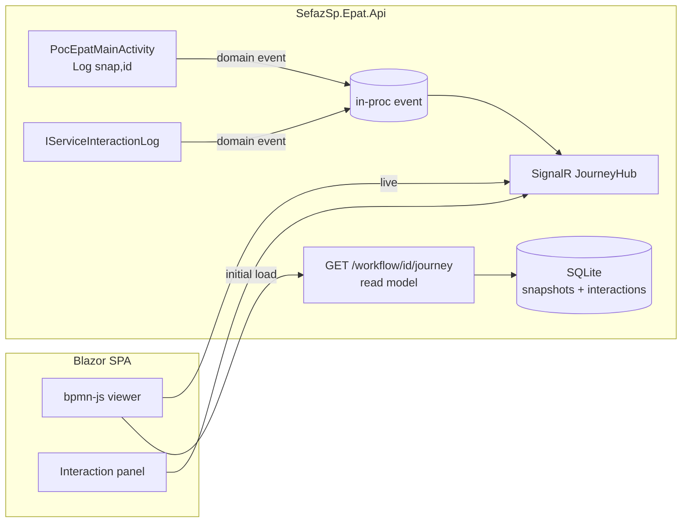

# Part 2 — Live Workflow Visibility (Blazor)

> Status: **SPEC / PLAN ONLY** — no implementation. This document scopes the online
> "see the workflow run" experience that builds on Part 1 (the durable interaction log)
> and the existing durable path (`snap.Path`).

## 1. Goal

Give a human a browser window that shows an ePAT case **executing in real time**: the BPMN
diagram of `POC_EpatProcess` (and its subprocesses) with the **current node highlighted**, the
**traversed path** drawn behind it, and a side panel listing the **service interactions**
(request/response) as they happen — sourced from the Part 1 log.

The value proposition over **Elsa Studio**: Elsa Studio can only show Elsa's own activity graph.
Our real business flow lives *inside* a single custom activity (`PocEpatMainActivity`), so Elsa
Studio renders it as one opaque box. This Blazor surface renders the **actual BPMN** the analysts
signed off on, highlighting the exact `NodeId` constants the orchestrator already emits. It is the
faithful view.

## 2. What already exists (the anchors — do not rebuild)

| Anchor | Where | What it gives us |
|---|---|---|
| Durable path | `PocEpatMainActivity.Log(snap, id)` → `snap.Path` (List<string> of BPMN node IDs) | The ordered list of traversed nodes, already persisted per PROCESS_ID via the snapshot store. |
| Node-ID ↔ BPMN | `artifacts/POC_Epat/bpmn/*.bpmn`; `NodeId` constants in `Workflows/**` | The diagram XML whose element IDs are exactly the strings in `snap.Path`. |
| Interaction log | Part 1 — `IServiceInteractionLog` / `GET /interactions/{processId}` | Per-call request/response, correlated by PROCESS_ID, with timing + success. |
| Durable snapshots | `EpatRuntimeDbContext` / `EpatSnapshotRow` | The state to read the current position from after any restart. |

Because both the path and the interactions are **already durable and keyed by PROCESS_ID**, the
live view is a *read model over existing data* plus a *push channel*. No orchestration change is
required for a first version.

## 3. Architecture



Two data paths, deliberately:

1. **Initial paint (pull).** On page load the SPA calls `GET /workflow/{processId}/journey`,
   a read-model endpoint that returns `{ processId, bpmnKey, traversed: [nodeId…], current, interactions: [...] }`
   assembled from the snapshot `Path` + the Part 1 log. This makes the view **correct after a
   restart or a late join** — no replay needed.
2. **Live updates (push).** A SignalR hub (`JourneyHub`) broadcasts two event types as they occur:
   `NodeTraversed(processId, nodeId, index)` and `ServiceCalled(processId, port, operation, success, at)`.
   The SPA appends them to the already-painted diagram.

### 3.1 Where events come from

- `NodeTraversed`: the cheapest faithful source is to have `Log(snap, id)` raise a domain event
  in addition to appending to `snap.Path`. Today `Log` is a `private static` helper that only
  knows the snapshot — it would need an injected sink (e.g. `IJourneyNotifier`) threaded through
  the activity. **This is the one orchestration touch-point** and must be additive (fire-and-forget,
  never on the business path's critical section). See §3.5 for the threading options.
- `ServiceCalled`: **zero orchestration change** — extend the Part 1 `IServiceInteractionLog`
  decorator (or add a second decorator) so that after `RecordAsync` it also publishes to the hub.
  The interaction log is already the choke point every service call passes through.

### 3.2 Suggested projects / files

| Item | Location | Notes |
|---|---|---|
| `IJourneyNotifier` (port) | `Application/Abstractions/Services/` | `NodeTraversedAsync`, `ServiceCalledAsync`. |
| `SignalRJourneyNotifier` | `Infrastructure/Realtime/` | Wraps `IHubContext<JourneyHub, IJourneyClient>`. |
| `NoOpJourneyNotifier` | `Infrastructure/Realtime/` | Default when realtime disabled (keeps tests/headless runs clean). |
| `JourneyHub`, `IJourneyClient` | `Api/Realtime/` | SignalR hub; clients join the `processId` group. |
| `WorkflowJourneyEndpoint` | `Api/Endpoints/` | `GET /workflow/{processId}/journey` read model. |
| `IBpmnDiagramCatalog` + impl | `Application` port / `Infrastructure/Realtime/` | Maps `bpmnKey → .bpmn` XML + node-id → subprocess drill-down. |
| Blazor SPA | new `src/SefazSp.Epat.Web/` (Blazor WASM) or a `wwwroot` page in the Api | Hosts bpmn-js + the SignalR client. |

### 3.3 Contracts (wire shapes)

The read model and the hub speak the **same node vocabulary** already fixed in
`PocEpatMainActivity.Sc001NodePath` (30 nodes) and its scenario variants (`Sc012MistaPath`,
`Sc010DrfPath`, `Sc014NodePath`, `Sc015NodePath`). One `JourneyStep` per appended node.

```csharp
// GET /workflow/{processId}/journey  →  200 JourneyView | 404
public sealed record JourneyView(
    string ProcessId,
    string BpmnKey,                 // e.g. "POC_EpatProcess__MAIN"
    string Status,                  // "Running" | "Suspended" | "Completed" | "Unknown"
    IReadOnlyList<JourneyStep> Traversed,
    string? CurrentNodeId,          // see §3.4
    IReadOnlyList<InteractionView> Interactions);

public sealed record JourneyStep(int Index, string NodeId);      // Index = position in snap.Path
public sealed record InteractionView(                            // projection of Part 1 ServiceInteraction
    string Port, string Operation, bool Success, string? Failure,
    DateTimeOffset At, long DurationMs);
```

Hub push messages (client method names on `IJourneyClient`):

```csharp
public interface IJourneyClient
{
    Task NodeTraversed(NodeTraversedMessage m);
    Task ServiceCalled(ServiceCalledMessage m);
}

public sealed record NodeTraversedMessage(string ProcessId, int Index, string NodeId, DateTimeOffset At);
public sealed record ServiceCalledMessage(string ProcessId, string Port, string Operation,
    bool Success, string? Failure, DateTimeOffset At, long DurationMs);
```

`Index` is the **monotonic 1-based position in `snap.Path`** — it is the idempotency/dedupe key the
client uses to ignore replays and to detect gaps after a reconnect (if the highest live `Index` is
ahead of what the client has, re-pull the read model).

### 3.4 "Current node" semantics

`CurrentNodeId` is derived, never stored:

| Runtime status | `CurrentNodeId` | Rationale |
|---|---|---|
| Suspended on a bookmark (`receiveTask`/`userTask`/timer) | **last** element of `snap.Path` | that node is the one blocking on the external event. |
| Running (mid-execute, no active viewer race) | last appended node | best-effort; the diagram is advancing. |
| Completed | `null` (the `endEvent` is the final `Traversed` entry) | nothing is "current". |
| Unknown / no snapshot | `null`, `Status = "Unknown"`, HTTP 404 for the whole view | the PROCESS_ID never started. |

The five canonical paths diverge only at node 24 (`Vistas do Juiz ?`); the shared prefix is
`Sc001NodePath[..24]`. The viewer highlights whatever is actually in `snap.Path`, so it renders the
**real** branch taken (SC-001 full, SC-012 MISTA, SC-010 DRF, SC-014 short-circuit, SC-015 no-correção)
without the read model needing to know which scenario is running.

### 3.5 Threading the notifier into `Log` (the single orchestration touch-point)

`Log` is `private static void Log(PocEpatMainSnapshot, string)`. Two additive options, in order of
preference:

1. **Instance field, fire-and-forget (preferred).** Give `PocEpatMainActivity` an
   `IJourneyNotifier? _notifier` resolved from `context.GetRequiredService<IJourneyNotifier>()` at
   the top of `ExecuteAsync`, make `Log` an instance method, and after `snap.Path.Add(id)` do
   `_ = _notifier.NodeTraversedAsync(snap.ProcessId, snap.Path.Count, id)` (discarded task,
   swallow-on-fault inside the notifier). No `await` on the business path.
2. **Post-hoc diff (zero touch to `Log`).** Do not touch the activity at all; instead, when the
   snapshot is persisted, compare the new `snap.Path` to the previously persisted one and emit
   `NodeTraversed` for the delta from the persistence layer. Slightly laggier (fires at save, not at
   traversal) but keeps `PocEpatMainActivity` byte-for-byte unchanged.

Use the `NoOpJourneyNotifier` by default so headless runs and the 2043-test suite stay silent and
unchanged; only the Api composition swaps in `SignalRJourneyNotifier`.

## 4. Read-model endpoint (pull)

Assembles the view from the two durable stores already in place — no new tables.

```csharp
// Api/Endpoints/WorkflowJourneyEndpoint.cs  (minimal-API sketch)
routes.MapGet("/workflow/{processId}/journey", async (
    string processId,
    IPocEpatProcessState state,      // reads the durable snapshot (snap.Path, status)
    IServiceInteractionLog log,      // Part 1
    IBpmnDiagramCatalog diagrams,    // bpmnKey resolution
    CancellationToken ct) =>
{
    var snap = await state.TryLoadAsync(processId, ct);
    if (snap is null) return Results.NotFound();

    var steps = snap.Path.Select((n, i) => new JourneyStep(i + 1, n)).ToArray();
    var status = snap.Completed ? "Completed" : snap.Suspended ? "Suspended" : "Running";
    var current = snap.Completed ? null : steps.LastOrDefault()?.NodeId;
    var interactions = (await log.GetAsync(processId, ct))
        .Select(x => new InteractionView(x.Port, x.Operation, x.Success, x.Failure, x.At, x.DurationMs))
        .ToArray();

    return Results.Ok(new JourneyView(
        processId, diagrams.KeyFor(snap), status, steps, current, interactions));
})
.WithTags("Evidence")
.WithSummary("Traversed BPMN path + service interactions for a PROCESS_ID");
```

> Note: `IPocEpatProcessState.TryLoadAsync` and the `Completed`/`Suspended` flags are the *shape*
> the read model needs; if the current `PocEpatProcessState` exposes only a resume path, add a
> read-only load overload (additive) rather than reaching into the DbContext from the endpoint.

## 5. The Blazor surface

- **Framework:** Blazor WebAssembly (standalone) served by the Api, OR Blazor Server. WASM keeps
  the Api stateless and is fine here because the heavy lifting (diagram) is a JS library anyway.
  Blazor Server would remove the WASM download but pins a circuit per viewer — for a read-only
  dashboard WASM is the simpler fit.
- **Diagram:** `bpmn-js` (the same engine bpmn.io/Camunda use) via JS interop. The `.bpmn` XML is
  served by the Api (`GET /workflow/diagrams/{bpmnKey}`) straight from `artifacts/POC_Epat/bpmn/`,
  so the front-end never bundles it.
- **JS interop contract** (a thin `journey.js` module the component calls):

  ```js
  // wraps bpmn-js so C# only deals with node ids
  export async function render(elementId, bpmnXml) { /* new BpmnJS(...).importXML */ }
  export function mark(nodeId, kind)   { canvas.addMarker(nodeId, kind); }   // kind: 'traversed' | 'current'
  export function clearCurrent()        { /* removeMarker(..., 'current') on the previous node */ }
  export function fit()                 { canvas.zoom('fit-viewport'); }
  ```

  C# side: `IJSObjectReference` calls `render` once with the XML from §4/diagrams endpoint, then
  `mark(nodeId,'traversed')` for each `JourneyStep`, and moves the single `'current'` marker as
  `NodeTraversed` arrives. CSS classes `.traversed .djs-visual > :nth-child(1)` (fill) and a pulsing
  `.current` keyframe give the highlight.
- **Panels:**
  - Left: the BPMN canvas with traversed nodes shaded and the current node pulsing.
  - Right: a live-scrolling list of interactions (port · operation · ✓/✗ · duration · timestamp),
    fed by `ServiceCalled` and backfilled from the read model. Payloads (request/response JSON) are
    **not** streamed — they stay behind the Part 1 `GET /interactions/{processId}` on demand.
  - Top: PROCESS_ID selector + "connection: live/reconnecting" indicator.
- **Reconnect story:** on SignalR reconnect, re-pull `GET /workflow/{id}/journey` and repaint —
  the pull endpoint is the source of truth, the hub is only an accelerator (see the `Index` gap
  check in §3.3).
- **Subprocess drill-down (later slice):** the stub nodes in `Sc001NodePath` (e.g. node 13
  `Aguardar Notificacao → DEAT0050`, node 18 `Prepara Intimação → PRPINTPC`, node 29
  `Controlar Intimados → CONTROPC`) map 1:1 to their own `.bpmn` files. `IBpmnDiagramCatalog`
  exposes `TryDrillDown(nodeId) → bpmnKey?` so a click swaps the canvas to the child diagram.

## 6. Realtime hub, config & security

- **Hub:** `JourneyHub : Hub<IJourneyClient>`. On connect the client calls `Subscribe(processId)`
  which does `Groups.AddToGroupAsync(ConnectionId, processId)`; the notifier broadcasts with
  `Clients.Group(processId).NodeTraversed(...)`. One group per PROCESS_ID keeps fan-out tight.
- **Config flag:** `Realtime:Enabled` (default **false**). When false, DI binds
  `NoOpJourneyNotifier` and the hub/endpoint are not mapped — identical to today's Api. Mirrors the
  Part 1 / `DeadlineTimer:Demo` pattern.
- **Auth:** the journey/diagram endpoints and the hub expose case-position + operation metadata, so
  they must sit behind the same authorization as the rest of the Api (at minimum an authenticated
  policy; ideally an authorization check that the caller may view that PROCESS_ID). The SignalR hub
  must enforce the same policy on `Subscribe` — never trust the client's group name blindly.
- **No PII on the wire:** `ServiceCalledMessage` carries port/operation/status/timing only. Request
  and response bodies remain server-side behind the audited Part 1 endpoint.

## 7. Delivery slices (each independently shippable)

1. **Read model only.** `GET /workflow/{processId}/journey` returning traversed path + interactions
   from existing durable stores. Testable headless (no UI). *Lowest risk, high value — proves the
   data is already there.*
2. **Static Blazor viewer.** Blazor page + bpmn-js loading the BPMN and highlighting the path from
   slice 1 (poll every N seconds). No SignalR yet.
3. **Live push.** Add `JourneyHub` + `SignalRJourneyNotifier`; decorate the interaction log to
   publish `ServiceCalled`. Still no orchestration change.
4. **Live node highlighting.** Thread `IJourneyNotifier` into `PocEpatMainActivity.Log` to publish
   `NodeTraversed`. The single additive orchestration touch-point.

Stop after any slice and you still have something demonstrable.

## 8. Risks / costs (flagged honestly)

- **Frontend toolchain cost.** bpmn-js + Blazor WASM means an npm/JS build step and a new
  front-end project. The workspace disk (drive C:) has repeatedly hit near-full; the existing
  `docs-site/` node_modules is already corrupted and disk-blocked. **A Blazor+npm build will need
  reclaimed disk first.** Slice 1 (read model) has *no* frontend cost and should go first.
- **Orchestration intrusion.** Only slice 4 touches `PocEpatMainActivity`. Keep it additive and
  fire-and-forget; a notifier failure must never affect the business flow (same discipline as the
  Part 1 best-effort log).
- **Subprocess coverage.** The first version highlights the main `POC_EpatProcess` diagram. The
  service subprocesses (CRNOTPC, PRPINTPC, …) have their own `.bpmn` and their own `NodeId`
  constants; showing *them* live is a later, larger slice (drill-down navigation between diagrams).
- **Not Elsa Studio.** This is intentionally a bespoke view. It will not show Elsa's internal
  bookmark/timer machinery — it shows the business BPMN. If someone wants Elsa's own graph, Elsa
  Studio already exists and is a separate, complementary tool.

## 9. Definition of done & test matrix

| # | Slice | Assertion | How proven |
|---|---|---|---|
| 1 | Read model | `journey` for a **completed SC-001** returns 30 steps ending at `_H22mclqWEfG5K7mY0I3I6w`, `Status=Completed`, `CurrentNodeId=null`. | Oracle test over `WebApplicationFactory` (run to completion, GET, assert). |
| 2 | Read model | `journey` for a **suspended** run returns the partial path, `Status=Suspended`, `CurrentNodeId` = last node. | Oracle test: start, stop at a bookmark, GET. |
| 3 | Read model | Branch fidelity: SC-012 MISTA / SC-010 DRF / SC-014 / SC-015 each return exactly their `Sc0**Path` node list. | Parameterised oracle test per scenario. |
| 4 | Read model | Interactions projection matches Part 1 log for the PROCESS_ID, JSON payloads omitted. | Oracle test asserts `InteractionView` fields, absence of payload. |
| 5 | Read model | Unknown PROCESS_ID → 404. | Oracle test. |
| 6 | Static viewer | Page renders `POC_EpatProcess__MAIN.bpmn` and marks the traversed nodes for a given PID. | Manual / Playwright smoke. |
| 7 | Live push | Starting a case advances the diagram and appends interactions in a second tab. | Manual / Playwright two-context smoke. |
| 8 | Live push | Notifier fault (client gone) never affects the run — full suite still **2043+ green**. | Full `dotnet test` with `Realtime:Enabled=true`. |
| 9 | Live push | Reconnect after missed messages re-pulls and converges to the read-model state. | Playwright: drop connection mid-run, assert final diagram matches `journey`. |

Regression guardrail for every slice: with `Realtime:Enabled=false` (the default) the Api and the
existing 2043 tests are byte-for-byte unaffected — the whole feature is opt-in.
