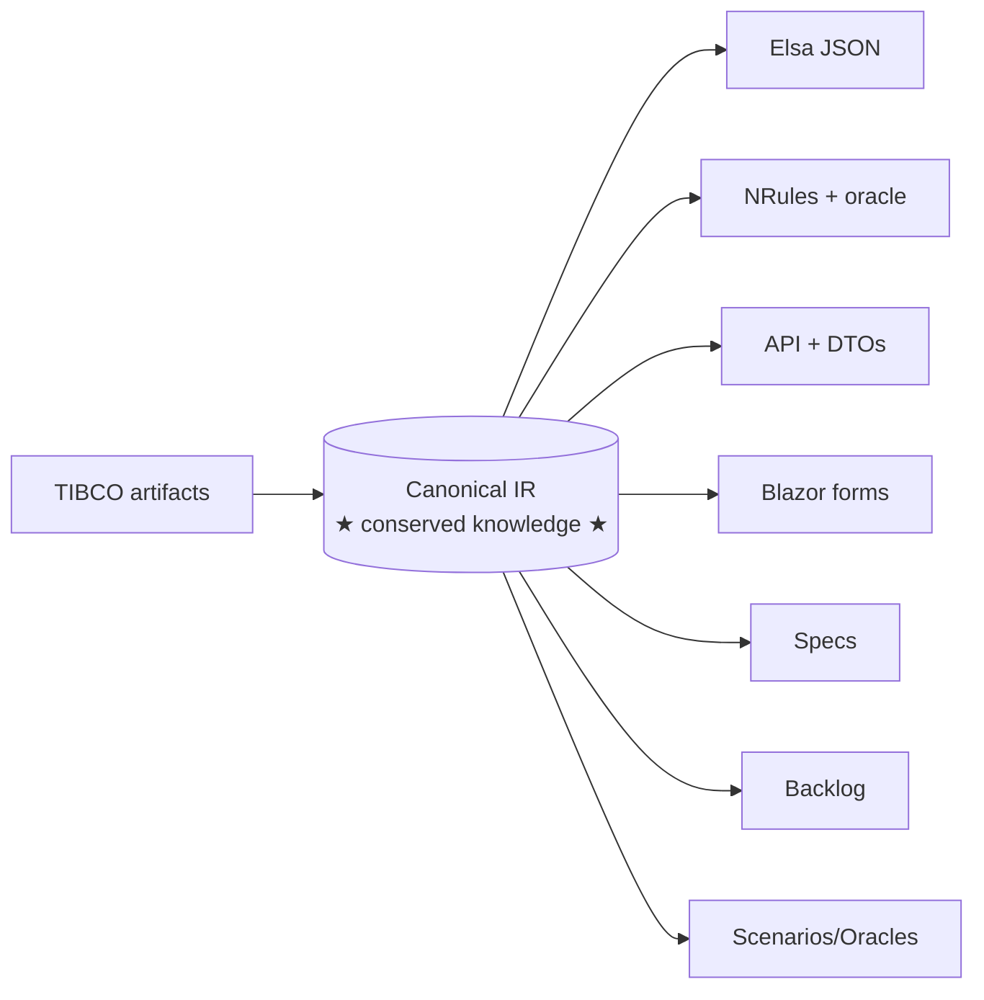
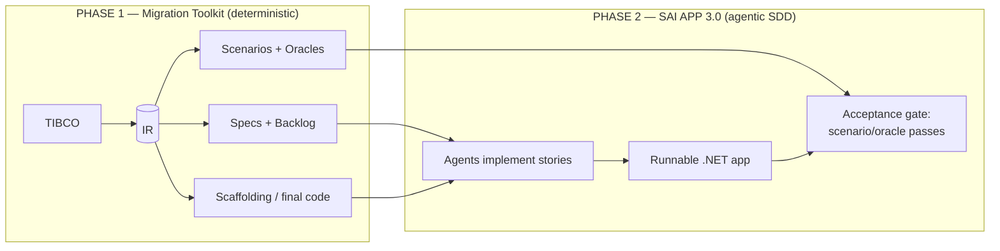
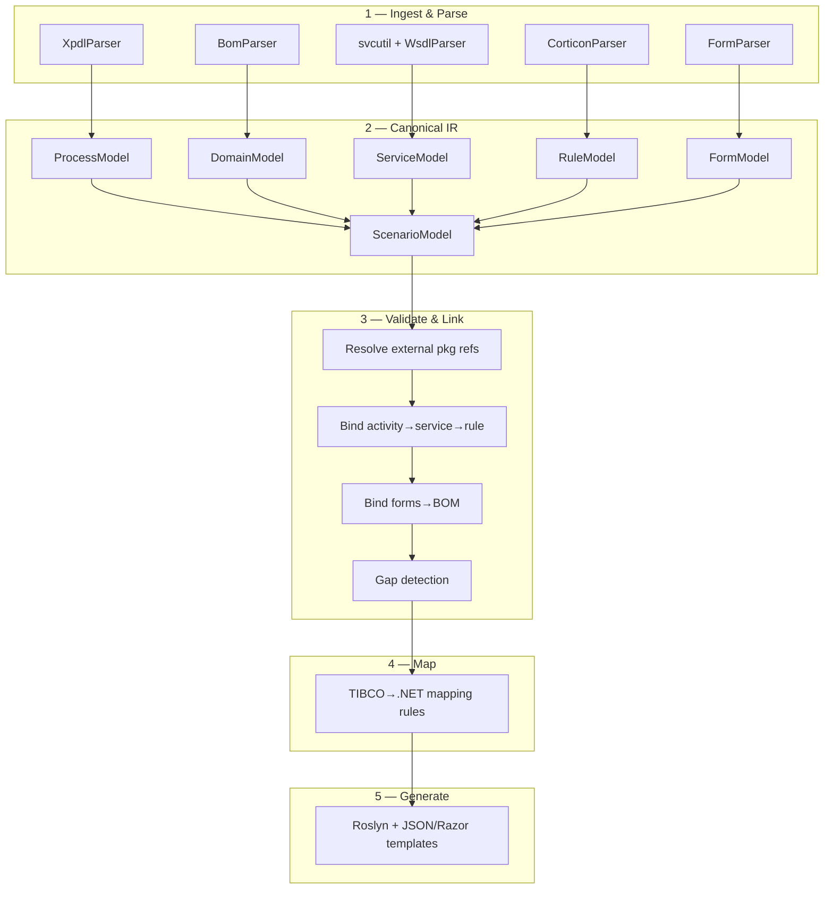
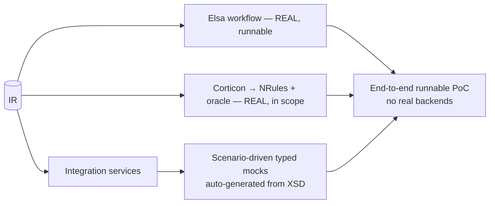
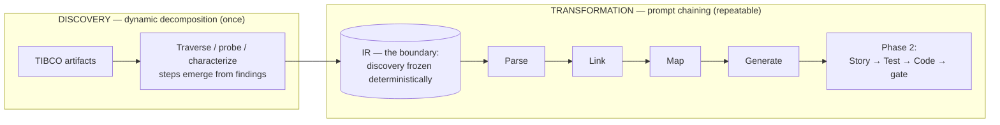
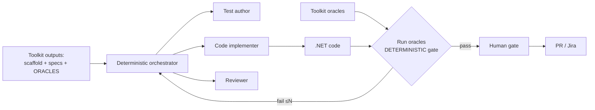
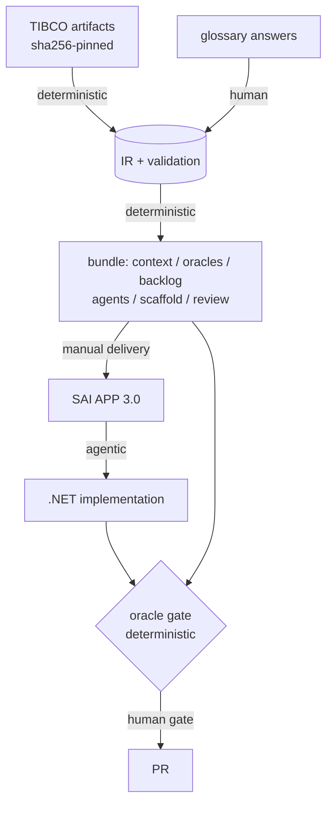

# TIBCO → .NET Migration — Solution Architecture

**Project:** SEFAZ-SP ePAT (Electronic Process for Labor Administrative Proceedings)
**Source platform:** TIBCO ActiveMatrix BPM (AMX BPM)
**Target platform:** .NET 8+ (ASP.NET Core, Elsa Workflows 3, NRules, EF Core, Blazor)
**Document type:** Architecture overview for stakeholder presentation
**Date:** 2026-06-30

---

## 1. Executive Summary

This document describes the architecture of a **migration application** that reads TIBCO
ActiveMatrix BPM artifacts, understands them, and produces the artifacts needed to rebuild the
system on .NET.

The solution is organized around three core ideas:

1. **A canonical Intermediate Representation (IR) is the single source of truth.** Every TIBCO
   artifact is parsed into one language-neutral model; every output is a projection of that model.
2. **Work is split by a lossless/lossy line that runs *through* each artifact.** Structure/data is
   transcribed deterministically; behavior/runtime-semantics requires interpretation.
3. **Two phases.** Phase 1 (this Migration Toolkit) produces deterministic scaffolding, faithful
   specifications, validation oracles, and a backlog. Phase 2 (**SAI APP 3.0**, agentic Spec-Driven
   Development) completes the semantic last mile.

**Key client decisions (locked):**
- Backend/integration service calls are **mocked**, **scenario-driven**, typed from response schemas.
- The **Decision (Corticon) service is translated for real** — not mocked — preserving the business rules.
- Mocks are **scenario-driven**, so every process branch/journey can be exercised and validated.

---

## 2. Source System Identification

The input is **TIBCO ActiveMatrix BPM**, a human-centric BPM suite — **not** TIBCO BusinessWorks
(an ESB/integration engine). This distinction drives the entire target architecture: BPM requires
reproducing **stateful long-running orchestration**, **human task management**, and **decision
services** — none of which exist in BusinessWorks.

| Evidence in `input/` | Indicates |
|----------------------|-----------|
| `POC_Epat.xpdl` — XPDL 2.1 with `iProcessExt`, `orchestrator` namespaces | AMX BPM process |
| `POC_Epat.bom` — UML2/Ecore XMI | Business Object Model (BPM-only concept) |
| `.form.xslt`, `.gwt.json`, Workspace Lite Forms | Human-task UI |
| `intimacoes_Parametros.ers` — Corticon Rulesheet | Decision service |
| `EPAT.wsdl`, `DecisionsEPAT.wsdl` | iProcess Service Agent contracts |

---

## 3. Input Artifacts Catalog

The end-to-end journey of the data — origin, transit and landing, with sizes, hashes and counts —
is documented separately in [DATA_FLOW.md](DATA_FLOW.md).

| Artifact | Format | Migration concern | IR target |
|----------|--------|-------------------|-----------|
| `POC_Epat.xpdl` (+14 external packages) | XPDL 2.1 XML | Orchestration, gateways, human tasks | `ProcessModel` |
| `POC_Epat.bom` | UML2/Ecore XMI | Domain entities, types, relationships | `DomainModel` |
| `EPAT.wsdl`, `DecisionsEPAT.wsdl` | WSDL 1.1 + XSD | 140+ service operations, message contracts | `ServiceModel` |
| `intimacoes_Parametros.ers` (+ `intimacoes.ecore`) | Corticon EMF XMI | Decision tables, conditions, results | `RuleModel` |
| `.form.xslt`, `.data.json`, `.properties`, `.locales.json` | XSLT/JSON | UI fields, bindings, i18n (pt_BR) | `FormModel` |

---

## 4. Core Architectural Principles

### 4.1 The IR is the single source of truth



Information is lost **only** if a parser fails to capture it into the IR. Every downstream output —
framework code *and* specifications — is a re-renderable projection. The obsession point is therefore
**IR completeness**, not output format.

### 4.2 The lossless / lossy split

A mapping is **lossless** when translation is *transcription* (total, structure-preserving,
round-trippable, choice-free) and **lossy** when it becomes *interpretation* (judgment required).

The split runs **through** each artifact, not between them:

| Artifact | Lossless half | Lossy half |
|----------|---------------|------------|
| **XPDL** | process graph (nodes, edges, gateways, lanes) | activity bodies (scripts, allocation, subflow logic) |
| **Corticon** | vocabulary + decision-table grid (**= the oracle**) | rule execution semantics + overrides |
| **WSDL** | operation signature + message schema | operation body *(now mocked — see §7)* |
| **BOM** | classes, attributes, types | — (essentially fully lossless) |

Guiding rule: **structure/data transcribes losslessly; behavior/runtime-semantics requires interpretation.**

### 4.3 Two-phase delivery



The generator alone does **not** produce a fully behavior-equivalent app; it produces a correct
skeleton plus precise specs and pass/fail oracles that the agentic phase completes.

---

## 5. Migration Pipeline



| Stage | Responsibility |
|-------|----------------|
| 1. Ingest & Parse | One parser per artifact type (`System.Xml.Linq`; `dotnet-svcutil` for WSDL) |
| 2. Canonical IR | Normalize into a single language-neutral object graph with stable IDs |
| 3. Validate & Link | Resolve 14+ external packages; bind tasks→services→rules; **flag unsupported constructs** |
| 4. Map | Apply explicit TIBCO→.NET construct mapping rules |
| 5. Generate | Emit final code, scaffolding, specs, backlog, scenarios/oracles |

---

## 6. Framework Selection

| Concern | Framework | Rationale |
|---------|-----------|-----------|
| Process orchestration (XPDL) | **Elsa Workflows 3** | Actively maintained, visual designer, strong long-running/bookmark support. Chosen over Workflow Core (effectively stagnant). |
| Business rules (Corticon) | **NRules** + decision-table oracle | Rete forward-chaining closest to Corticon; table preserved as authority. |
| Services (WSDL) | **ASP.NET Core** | Standard, minimal APIs/controllers. |
| Data (BOM/XSD) | **EF Core** | Lossless entity generation. |
| UI (GWT Forms) | **Blazor** | Component model + i18n via `.resx`. |
| Code generation | **Roslyn** | Modern, type-safe C# emission (replaces T4). |

---

## 7. Service Mocking Strategy

Per client decision, **backend/integration service calls are mocked**, which removes the highest-risk,
highest-cost part of the migration (reconnecting 140+ integrations). Mocking-by-output-type flips the
service body from **lossy** back to **lossless** — a mock is simply "return a value of this declared
type," generatable from the response XSD.



**Scope boundary:**
- ✅ **Mock** backend/integration services (data access, GDOC/GED/EMS, legacy DBs).
- ✅ **Translate for real** the Decision (Corticon) service — business rules are lossless data and are preserved.
- ⚠️ Corticon **override semantics** (`overriddenBy`) remain a flagged gap even though rules are in scope.

Mocks are **scenario-driven** (not fixed canned values) so that data-based exclusive gateways
(e.g. `Trocar Notificação?`, `Vistas Mista?`) can be steered down every branch for full journey coverage.

---

## 8. The Scenario Model — Unifying Artifact

Scenario-driven mocking introduces a single artifact that serves four roles at once:

```
Scenario =
    initial inputs
  + mock service outputs per step    → steers each data-based gateway
  + expected gateway path            → the XPDL journey / chain
  + expected final state             → the assertion
```

| Role | Consumed by |
|------|-------------|
| Mock fixture | Generated scenario-driven service mocks |
| Journey / path oracle | Validation (branch & journey coverage) |
| Acceptance gate ("done") | SAI APP 3.0 stories |
| Demo script | Runnable PoC walkthrough |

Mocks and test oracles therefore **collapse into one model** in the IR (`ScenarioModel`): journeys are
authored once and drive execution, validation, agent acceptance, and demos.

---

## 9. Outputs Catalog (Dual Projection)

| Output | Source | Status | Project |
|--------|--------|--------|---------|
| Elsa workflow (real, runnable) | XPDL graph | **Final** | `Fazenda.ePAT.Workflows` |
| EF Core entities + DbContext | BOM + XSD | **Final** (lossless) | `Fazenda.ePAT.Data` |
| API signatures + DTOs | WSDL | **Final** (lossless) | `Fazenda.ePAT.Api` |
| NRules rules | Corticon | **Draft** + override gap flagged | `Fazenda.ePAT.Rules` |
| Decision-table oracle | Corticon grid | **Final** (authority) | `Fazenda.ePAT.Rules.Tests` |
| Scenario-driven service mocks | WSDL response XSD + Scenario | **Final** (lossless) | `Fazenda.ePAT.Mocks` |
| Scenario suite | XPDL paths + mock outputs | **Final** | `Fazenda.ePAT.Scenarios` |
| Blazor forms | GWT Forms | Scaffold + behavior spec | `Fazenda.ePAT.Web` |
| Backlog + specs | lossy residue | **For SAI APP 3.0** | toolkit output |
| Migration report | linker/gap data | **Final** | toolkit output |

---

## 10. Validation Strategy

Validation separates two distinct verifications:

- **Completeness (presence)** — static. The linker walks the IR and asserts every TIBCO element
  (activity, entity, operation, rule row, form field) has a generated counterpart. Output:
  traceability matrix + coverage % + gap list.
- **Correctness (behavior)** — dynamic, oracle-based:
  - **Corticon decision tables** are themselves oracles (each row = a test case).
  - **XPDL process paths** are journeys → each becomes a scenario assertion.
  - **WSDL schemas** drive contract checks for mocks.

Each backlog story carries its IR-derived oracle as its definition of done, so validation is
**embedded** in the agentic phase rather than being a separate stage.

---

## 11. Migration Toolkit — Component Structure

```mermaid
flowchart TB
    subgraph CLI["Tibco.Migration.Toolkit (console / CLI)"]
        CMD[Orchestrator / pipeline runner]
        subgraph PARSERS
            p1[XpdlParser]; p2[BomParser]; p3[WsdlParser]
            p4[CorticonParser]; p5[FormParser]
        end
        subgraph CORE
            ir[Canonical IR + ScenarioModel]; link[Linker/Validator]; map[Mapper]
        end
        subgraph GENERATORS
            g1[ElsaJsonGenerator]; g2[NRulesGenerator]; g3[ApiGenerator]
            g4[EfCoreGenerator]; g5[BlazorGenerator]
            g6[MockGenerator]; g7[ScenarioGenerator]; g8[BacklogGenerator]; g9[ReportGenerator]
        end
        CMD-->PARSERS-->ir-->link-->map-->GENERATORS
    end
```



```
Tibco.Migration.Toolkit/
├── Cli/            pipeline orchestration, config
├── Parsers/        one class per artifact type
├── Ir/             canonical model (Process, Domain, Service, Rule, Form, Scenario)
├── Linking/        cross-ref resolver, validator, gap detector
├── Mapping/        TIBCO→.NET mapping rules
├── Generators/     Roslyn + template emitters (code, mocks, scenarios, backlog)
└── Reporting/      traceability + gap report
```

**Design principles:** IR-centric (parsers and generators communicate only through the IR);
one parser/generator per concern; generate-don't-hand-edit (reproducible on re-export); gap-first
(unsupported constructs surface as report items, never silent failures).

---

## 12. Agent Placement & Phase-2 Agent Topology

### 12.1 Governing principle

> **Deterministic signals gate progress. LLM judgment never hard-gates — it advises. Use agents
> only where genuine semantic judgment is required.**

This is inherited from the SAI APP 3.0 orchestration principles (P2 "no LLM judgment is ever a hard
gate", P3 "only deterministic signals gate") and the context-integrity rules (no poisoning, no stale
state, provenance on every fact). Applied here, it partitions the two phases sharply.

### 12.2 Decomposition strategy — discovery is dynamic, transformation is chained

Task decomposition has two strategies, selected by one question: **do you know all the steps before
you start?**

| | **Prompt chaining** | **Dynamic decomposition** |
|---|---|---|
| Steps defined | Upfront, fixed order (output of Step N → Step N+1) | Emergently, from what each stage discovers |
| Control | High — deterministic pipeline | Lower — the model navigates |
| Analogy | Actor reading a script | Detective following clues |
| Use when | Same steps every time; compliance/audit reproducibility | Unknown scope, depth, or number of phases |
| Warning | Breaks the moment findings diverge from initial assumptions | — |

A legacy migration is the canonical **dynamic decomposition** case: you cannot define the steps
before exploring the system. That is true here — the main process alone is **12,626 lines, 215
activities, 221 transitions, 61 gateways, 40 script tasks, 8 subflows, 9 processes and 15 external
packages**. The dependency graph is only knowable by traversing it.

**This architecture therefore splits the work in two, with the IR as the boundary:**



| Activity | Strategy | Why |
|----------|----------|-----|
| Legacy archaeology (what does it actually do?) | **Dynamic** | Steps emerge: parse main → discover refs to `NotificacaoAIIM`, `Decisions`, `Calendario`, `iProcess` → traverse → discover more |
| Characterization against the live TIBCO (fidelity) | **Dynamic** | Each probe's target depends on the previous finding |
| Gap resolution for no-equivalent constructs (Corticon overrides) | **Dynamic**, bounded + advisory | Alternatives are explored, not scripted |
| Parse → IR → link → map → generate | **Chaining** | Fixed, reproducible — the compliance/audit case |
| Phase 2: Story → Test → Code → oracle gate | **Chaining**, bounded loops | Known steps, deterministically gated |

> **Design thesis:** the unavoidable dynamic discovery is run **once** and frozen into the IR; from
> the IR onward everything is reproducible chaining. The engineering goal is to push the
> dynamic→chaining boundary **as early and as complete as possible**. Needing dynamic decomposition
> inside the transformation pipeline is a signal that the **IR is incomplete**.

This also explains §12.3: the pipeline core is the *chaining* half (no exploration required, so no
agents), while the two sanctioned agent pockets — legacy discovery and gap resolution — are exactly
the *dynamic* half.

### 12.3 Where agents do and do not run

| Location | Agents? | Rationale |
|----------|---------|-----------|
| **Building the toolkit** (Phase 1 as software) | Optional, human-reviewed | Ordinary deterministic software, and the **trust anchor** that produces oracles — must be human-owned and well-tested |
| **Transformation pipeline core** (TIBCO→IR→outputs) | **No** | Parsing XML/XMI/WSDL/Corticon + Roslyn/template generation is deterministic transcription; an LLM here would break **IR-completeness** and risk poisoning/confusion |
| **Transformation pipeline edges** (Phase 1) | Advisory only | May draft natural-language story prose or *propose* a .NET pattern for a no-equivalent gap (e.g. Corticon overrides); a human decides; **never** extracts oracle values (anti-tautology) |
| **SAI APP 3.0** (Phase 2 — build the .NET app) | **Yes — the agentic layer** | Implementing lossy activity/rule/UI bodies from specs is the semantic-judgment work; gated by deterministic oracles |

**Why the pipeline core stays agent-free:** XPDL/BOM/Corticon are structured sources of truth.
Parsing them deterministically preserves the guarantee that every output is a faithful projection of
the IR. Using an LLM as the reader would inject stochastic error into the one artifact (the IR) the
whole design depends on.

### 12.4 Phase-2 agent topology

Phase 2 follows the SAI APP 3.0 graph (Story → Test → Code → **run tests** → human gate → PR), where
**our scenario/decision-table oracles are the "tests" that gate** ("tests are the spec").



Structure (per the agent implementation templates):

- **One deterministic orchestrator** routes work; specialist sub-agents do not hand off freely.
- **Specialist sub-agents** — Test author, Code implementer, Reviewer — each with a narrow tool/skill set.
- **Isolated sessions** — every story/sub-agent runs in a clean, ephemeral context window; only a
  distilled result returns (no context bleed).
- **Structured findings with provenance** — results carry claim→source citations back to IR nodes.
- **Least-privilege** — only the Code implementer and the post-approval side-effect stage hold
  `write` tools; reviewers are read-only and advisory.
- **Budget-aware context** — each agent receives the relevant **IR slice + its oracle**, not the
  whole IR (the toolkit exposes IR + oracles as read-only MCP resources).

### 12.5 Guards on the agentic phase

- **Review with a different model than the generator** — avoids shared blind spots in AI-generated
  .NET (plausible-but-wrong logic, hallucinated APIs, dead scaffolding); pair with code-review +
  architecture-fitness checks.
- **Sanitize untrusted TIBCO text** — XPDL descriptions, comments, and form labels may carry
  prompt-injection payloads; sanitize before any of it enters an agent prompt (tool/artifact output
  is never treated as an instruction).
- **Fidelity oracle** — to prove the IR faithfully captured TIBCO (not just that .NET matches the IR),
  supplement with golden-master / characterization tests captured from the live TIBCO system.

---

## 13. Scope & Decisions Log

| # | Decision | Status |
|---|----------|--------|
| 1 | Source is AMX BPM (not BusinessWorks) | Confirmed |
| 2 | Workflow engine: Elsa 3 (not Workflow Core) | Confirmed |
| 3 | Two-phase model: Toolkit (deterministic) + SAI APP 3.0 (agentic SDD) | Confirmed |
| 4 | IR is single source of truth; outputs are projections | Confirmed |
| 5 | Backend/integration services mocked | Confirmed (client) |
| 6 | Decision/Corticon service translated for real (not mocked) | Confirmed (client) |
| 7 | Mocks scenario-driven | Confirmed (client) |
| 8 | No agents in the transformation pipeline core; agents only in Phase 2 (SAI APP 3.0) | Confirmed |
| 9 | Deterministic oracles gate; LLM advises, never hard-gates | Confirmed |
| 10 | Phase-2: one orchestrator + isolated specialist sub-agents, least-privilege writes | Confirmed |
| 11 | Discovery = dynamic decomposition (once); transformation = prompt chaining; IR is the boundary | Confirmed |
| 12 | The toolkit emits identifiers, never invents names — naming is transcription only | Confirmed |
| 13 | Original TIBCO identifiers are kept; business meaning is attached via backlog cards | Confirmed (client) |
| 14 | Agent manifests ship inside the bundle | Confirmed (client) |
| 15 | Open blockers are documented, not a hard release gate | Confirmed (client) |
| 16 | Bundle ships specs + .NET scaffolds only — no implementation bodies | Confirmed (client) |
| 17 | Bundle production is fully deterministic; no agents run before delivery | Confirmed |
| 18 | Backend + frontend (multi-export, evidence lane, run diffing) deferred to MVP — see §17 | Confirmed (client) |
| 19 | Corticon override semantics flagged as gap despite in-scope rules | Open (track) |
| 20 | SAI APP 3.0 card field mapping (ingest is Jira; exact fields unconfirmed) | Open (to confirm) |

---

## 14. Naming Rule — how determinism survives the need for names

A deterministic generator cannot invent a business name for `ISAPPERROR`: naming is interpretation,
and interpretation is the lossy half. The pipeline therefore **never names anything**. Every
human-readable string it emits is *transcribed* from a source artifact, which is choice-free:

| Mechanism | Source | Count | Marked as |
|-----------|--------|-------|-----------|
| Original identifier, verbatim | XPDL | 209 fields | identity — never rewritten |
| `labelSuggestion` | the `.form` label already written by TIBCO | 23 | "NAO verificado" — a suggestion, not a name |
| `fullName` | XPDL, where iProcess truncated the id to 15 chars | 14 | recovered, with the reason recorded |
| `labelConflictsWith` | detected clash (a form labels a field with another field's name) | 2 | flagged for a human — never auto-resolved |
| `term: ""` in the glossary | nothing — deliberately left empty | all | the seam where a human or agent supplies meaning |

**Rule:** the toolkit emits **identifiers**; names arrive later, through the glossary or a backlog card.

**Corollary — identity vs. presentation.** The identifier stays the C# property identity because it is
the addressable link back to the XPDL element. A business term belongs in presentation metadata
(doc comment, `DisplayName`, `.resx`), never in the identity. Otherwise a later rename silently
breaks the claim-to-source trace that the whole validation strategy depends on.

---

## 15. Delivery Bundle

The bundle is what is handed to SAI APP 3.0. **Its production is fully deterministic — no agent runs
before delivery.** Everything in it is either a projection of the IR or a human answer already
captured in the glossary.

| Folder | Contains |
|--------|----------|
| `manifest.json` | sha256 of sources and artifacts, schema versions, counts, open-question status |
| `context/` | The IR artifacts + BPMN/DMN — the agents' read-only resource corpus |
| `oracles/` | Decision-table cases, scenario paths, schema conformance — immutable golden fixtures |
| `backlog/` | Cards per `backlog-card.schema.json`, in two streams: build and validation |
| `agents/` | Agent manifests (Test author, Code implementer, Reviewer) with pinned tools, skills, budgets |
| `scaffold/` | Lossless .NET only: entities, DTOs, workflow skeletons, typed mocks — no bodies |
| `glossary/` | Answered human decisions |
| `review/` | Open questions carried as documentation, including any unresolved blocker |



**Reproducibility property:** the same sources plus the same glossary must yield a byte-identical
bundle. Card prose is therefore rendered from templates and glossary terms, never drafted by a model
— an LLM in the bundle path would forfeit this property.

---

## 16. Agent Tiers

| Tier | Builds | Agents | Deterministic gate |
|------|--------|--------|--------------------|
| **T0** | The toolkit itself | Yes, gated | `validate-artifacts.ps1` (27 checks, incl. CV-001..004 coverage) + DMN equivalence over 3,000 randomized cases |
| **T1** | A pipeline run (TIBCO → IR → bundle) | None | — |
| **T2** | The .NET application, inside SAI APP 3.0 | Yes | The oracles shipped in the bundle |

T0 is safe because the toolkit already carries its own fitness function: the coverage checks *are* the
IR-completeness oracle, and the equivalence harness is a property-based oracle over the rules. Two
guards apply:

1. **Author is not verifier** — the agent that writes a parser must not write the check that proves it.
2. **Mutation-test the validators** — a check is only trustworthy once it has been shown to fail on a
   deliberately corrupted artifact. All 27 currently pass, but have not been proven capable of failing.

---

## 17. Out of Scope for this PoC

Recorded so the omissions read as decisions rather than oversights.

| Not built | Deferred to | Rationale |
|-----------|-------------|-----------|
| Backend service (packages, exports, run history, job orchestration) | MVP | The PoC runs one package from the command line; multi-package and run history only pay off once a second export exists |
| Frontend for answering questions and diffing runs | MVP | Answers are captured in `config/glossary/<package>.yaml`, which the generator preserves across runs |
| Answers as database records, with carry-forward and staleness detection | MVP | Needed only when the same question survives across two exports |
| Run diffing between exports | MVP | Requires the export/run model above |
| Evidence lane — documents, screenshots and notes indexed for retrieval | MVP | Distinct from sources: evidence corroborates a human answer and must never write to the IR |
| Secret scanning and redaction on ingest | MVP | Mandatory before any service ingests legacy `.aspx.cs` or WSDL endpoints, which routinely carry credentials |

What stays in the PoC: the deterministic PowerShell pipeline (S0–S5), the artifacts, the validators,
the DMN equivalence proof, the generated documentation site, and the delivery bundle.

---

## 18. Open Items

1. **SAI APP 3.0 interface contract** — confirm the backlog/spec format it ingests (Markdown stories,
   JSON/YAML schema, Gherkin `.feature`, tracker issues) to finalize the Stage-5 generator targets.
2. **Scaffolding boundary** — confirm whether SAI APP 3.0 expects project scaffolding to pre-exist or
   generates structure itself (sets the deterministic-vs-agentic line).
3. **Corticon override handling** — decide the .NET pattern for rule overrides/conflict resolution.
